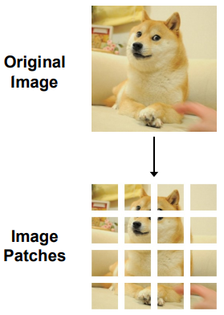
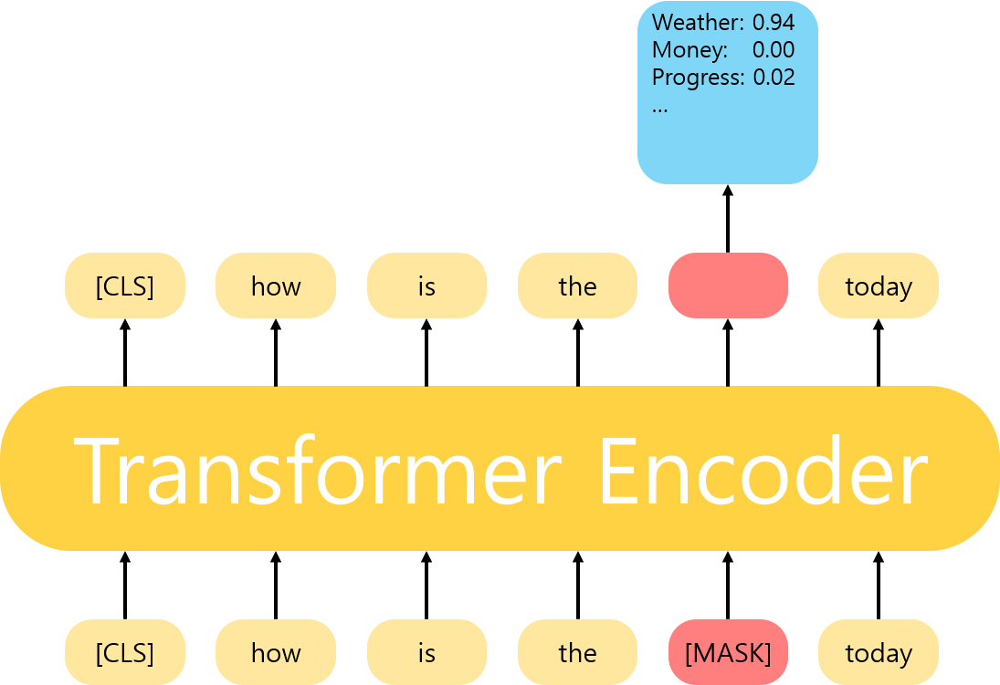
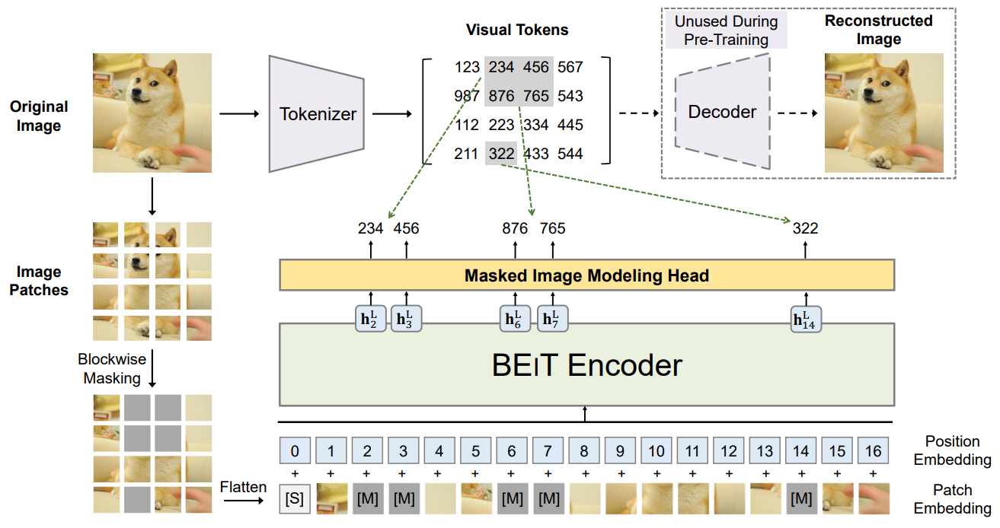
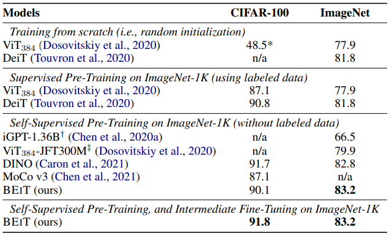
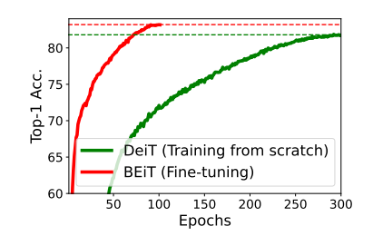
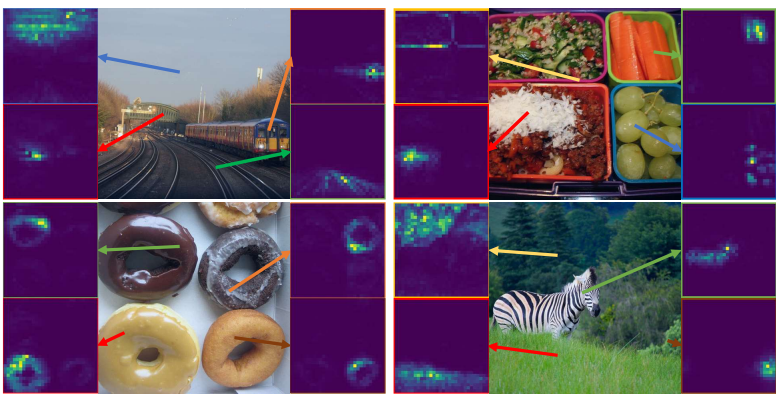
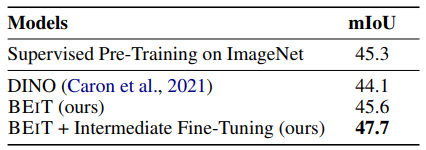

# BEIT: BERT Pre-Training of Image Transformers \[Kor\]

##  1. Problem definition

이 논문은 self-supervised pre-training을 통해 이미지의 representation learning을 수행하는 연구를 진행했습니다. 기존에 비전 영역에서 한 이미지에 서로 다른 perturbation을 적용한 뒤 이를 바탕으로 representation learning을 진행하던 [SimCLR](https://arxiv.org/abs/2002.05709)나 [BYOL](https://arxiv.org/abs/2006.07733) 등과는 다르게, NLP 영역에서 큰 성과를 거둔 [BERT](https://arxiv.org/abs/1810.04805)의 Masked Language Modeling(MLM)을 이미지에 적용시킨 것이 이 논문의 주된 contribution이라 할 수 있겠습니다.

pre-training으로 학습된 representation의 성능을 검증하기 위한 fine-tuning task (혹은 downstream task)로는 이미지 분류(image classification)와 semantic segmentation을 진행했습니다.

## 2. Motivation

### Related Works

### Self-supervised Representation Learning
비전 영역에서 주로 이루어진 representation learning 중 대표적인 연구를 꼽으라면 [SimCLR (Chen et al.)](https://arxiv.org/abs/2002.05709)를 빼놓을 수 없습니다. 이 연구는 contrastive learning을 통해 이미지의 representation learning을 진행한 연구인데요, contrastive learning의 기본 개념과 함께 간단히 설명드리겠습니다.

Contrastive learning은 각 이미지가 모델을 통과해서 나온 latent vector (혹은 representation vector)가 존재하는 latent space 상에서, positive pair들의 latent vector들끼리는 가깝게 negative pair들의 latent vector들끼리는 멀게 학습시키는 방식을 말합니다. 이를 수행하기 위해 주로 InfoNCE라고 불리는, 아래의 loss 함수를 통해 모델을 최적화시키는데요, 직관적으로 설명드리자면 positive pair 혹은 negative pair에서 나온 latent vector pair들끼리의 similarity를 계산한 뒤 이를 분류 문제에서의 logit 값으로 취급하여 cross entropy로 학습시킨다고 보시면 됩니다. 이 때, cross entropy 텀의 Ground Truth label은 positive pair가 되기 때문에 학습 과정에서 positive pair의 similarity는 높이고 negative pair의 similarity는 낮아지게 됩니다.
$$
L_{i,j}=-\log{\frac{exp(sim(z_i, z_j))}{\sum_{k=1}^{N}{\textbf{1}_{[k \neq i]}exp(sim(z_i, z_k))}}}
$$
여기서 (i, j) pair는 positive pair의 이미지 인덱스를 의미하고, $$z_i$$는 $$i$$번째 이미지가 모델을 통과하여 나온 latent vector입니다. 또한 두 벡터 사이의 similarity를 나타내는 $$sim(\cdot)$$ 함수는 내적 혹은 cosine similarity를 사용하곤 합니다.  
이러한 contrastive learning의 고질적인 문제 중 하나는 모델이 학습하는 과정에서 collapse가 일어난다는 점입니다. 무슨 말이냐면, 우리가 기대하기로는 모델이 positive pair인 이미지들끼리는 멀게 하고 negative pair인 이미지들끼리는 멀게 해서 latent space 상에 다양한 이미지들의 representatation vector를 여기저기 흩뿌려줄 줄 알았는데, 실제로 해보니까 그렇게 되지 않고 이미지들의 representation vector들이 latent space의 아주 작은 부분 안에서만 놀고 있더라는 것입니다. 모델이 이렇게 학습되는 핵심적인 원인은 위에서 정의된 loss 함수와 관련이 있는데요, 자세히 보시면 positive pair 간의 similarity가 매우 높기만 하면 loss 값이 떨어질 것이라는 생각을 하실 수 있을 겁니다. 물론 negative pair 간의 similarity에 비해서 positive pair 간의 similarity가 높아야 하겠지만 (이렇게 학습되길 기대한 것이기도 하고요), 모델이 해당 loss 함수를 최적화하는 과정에서 그냥 모든 이미지들을 비슷한 representation vector로 만들어버리는 것이 negative pair들 간의 similarity도 함께 고려하는 것보다 loss를 떨어뜨리기 수월하기 때문에 이런 일이 발생했을 가능성이 있습니다. 결국 모델이 pre-training 단계에서 이렇게 모든 이미지들을 비슷한 representation vector로 만들어버리면 당연히 fine-tuning 단계에서 이미지 분류나 semantic segmentation 등의 downstream task를 수행하는 것을 오히려 더 어렵게 만듭니다.  
이러한 고질적인 문제를 해결함과 동시에 contrastive learning을 통해 의미있는 성능 향상을 보여준 대표적인 비전 페이퍼가 바로 [SimCLR (Chen et al.)](https://arxiv.org/abs/2002.05709)입니다. 이 논문의 주요 contribution과 그 방법은 다음과 같이 정리해볼 수 있겠습니다.
* 모델을 학습시킬 때 배치 사이즈를 크게 늘리는 것과 동시에 배치 내에서 자신의 positive sample을 제외한 모든 다른 이미지를 negative sample로 취급함으로써 엄청나게 많은 negative pair를 통해 위에서 말씀드린 model collapse를 방지했습니다.
* Contrastive learning의 핵심이라고 할 수 있는 positive pair를 한 이미지에 서로 다른 transformation (혹은 perturbation)을 적용하여 나온 두 이미지로 정의하는 것을 제안했으며, 이를 통해 downstream task에 대해 의미 있는 성능 향상을 보여주었습니다.
* 위와 같이 positive pair를 구성할 때 효과적인 transformation의 조합을 제시했습니다.

한편, representation learning은 위처럼 contrastive learning을 통해서만 할 수 있는 것은 아닙니다. 오히려 contrastive task는 pre-training 단계에서 할 수 있는 pretext task의 일부일 뿐인데요, 이 논문에서 이미지의 representation learning을 위해 사용하는 방식 또한 contrastive learning이 아닌 Masked Image Modeling(MIM)으로, [BERT (Devlin et al.)](https://arxiv.org/abs/1810.04805)에서 NLP를 위해 사용된 MLM을 이미지 도메인에 맞게 변형시킨 형태입니다. 이 논문의 핵심이라고 해당할 수 있는 아이디어가 BERT에서 motivated된 만큼, BERT에 대해서도 간단히 설명드리겠습니다.  
BERT는 자연어 도메인에서 pre-training 방법론을 제시했고, 이를 Transformer Encoder에 적용하여 NLP 영역에서 대부분의 downstream task에 대해 일관적으로 성능 향상을 보여준 논문입니다. BERT에서 제시한 pre-training 방법에는 총 두 가지, MLM과 Next Sentence Prediction(NSP)이 있습니다.
* Masked Language Modeling  
MLM은 input token들로 이루어진 sequence에서 일부 random한 token을 선택하여 \[MASK\]라는 token으로 대체한 상태로 모델을 통과시킨 뒤, 해당 token의 output에 linear layer를 달아 mask되기 전의 원래 token이 무엇이었는지를 맞추는 task입니다.

* Next Sentence Prediction  
BERT는 위에서 MLM을 하는 것과 동시에 NSP를 통해서도 모델을 학습시키는데요, NSP는 input sequence가 두 개의 sentence들로 이루어졌을 때 그 두 sentence가 연결되어 있는 문장인지, 아닌지를 맞추는 task입니다.

### Transformers for Visual Tasks
NLP 영역에서 Transformer 아키텍쳐는 기존의 RNN에 비해 놀라울만큼의 성능 향상을 보여주었습니다. 그 흐름에 따라 비전 영역에서도 Transformer를 활용하는 연구들이 이루어졌는데, 대표적으로 fully-Transformer-based 아키텍쳐를 통해 이미지 분류 태스크를 진행한 [vision transformer (Dosovitskiy et al.)](https://arxiv.org/abs/2010.11929) (ViT)와, semantic segmentation과 같은 scene understanding 태스크를 진행한 [swin transformer (Liu et al.)](https://arxiv.org/abs/2103.14030)를 들 수 있습니다. 이 모델들은 현재 다양한 SOTA 모델들의 backbone 아키텍쳐로 쓰이고 있는데요, Transformer의 핵심 아이디어인 self-attention mechanism 탓에 충분한 computational resource와 training time이 필요하다는 단점이 있습니다. 또한 Transformer 아키텍쳐는 일반적으로 CNN-based 모델보다 더 많은 학습 데이터를 요구하기 때문에 성능은 보장되지만 학습시키기 위한 조건이 까다롭다는 점이 대표적인 문제라고 할 수 있습니다.

### Idea

이 논문의 핵심 아이디어는 다음과 같이 요약할 수 있습니다.

* Self-supervised Learning을 통해 Vision Transformer가 CNN-based model에 비해 더 많은 학습 데이터를 요구한다는 문제를 해결
* 이 때, self-supervised learning의 방법론으로서 기존에 NLP 영역에서 엄청난 성과를 보여준 BERT의 MLM을 이미지 도메인에 적용할 수 있도록 변형하여 제시

## 3. Method

### Image Patch



먼저, input으로 사용되는 224 x 224 이미지를 16 x 16의 작은 patch들로 쪼갭니다. 따라서 총 (224 / 16) x (224 / 16) = 14 x 14개의 patch로 쪼개지며, 좌상부터 우하까지 순서대로 Vision Transformer의 input sequence를 구성합니다.

### Visual Token
BERT처럼 input sequence의 일부를 masking한 뒤 mask되기 전의 token을 예측하는 MLM을 하기 위해서는, input patch에 대한 discretization이 이루어져야 합니다. 물론, mask된 token이 통과해서 나온 hidden token을 mask되기 전의 원본 이미지로 복원시키는 일종의 regression task를 진행할 수는 있겠지만, 저자의 말에 따르면 이는 적절한 방법이 아니라고 합니다.
> However, such pixel-level recovery task tends to waste modeling capability on pre-training short-range dependencies and high-frequency details.

따라서, 우리는 MLM처럼 discrimination (classification) task, 즉 hidden token을 통해 mask되기 전의 원본을 예측하게끔 하여 모델을 학습시킬 겁니다. 이를 위해서는 앞서 언급한대로 input patch에 대한 discretization이 필요하다고 했는데요, 이게 무엇을 의미하는 걸까요?  



위 그림을 보시죠. 만약 우리가 MLM을 한다면 위와 같이 mask된 token이 모델을 통과하고 나온 hidden token에서 미리 정의된 vocabulary에 있는 단어들 중 하나로 classification을 진행할 겁니다. Classification 결과 가장 높은 확률값을 가진 단어가 모델이 예측하는 가장 그럴듯한 단어겠죠. 그런데 우리는 자연어를 input으로 통과시킬 것이 아니라 image patch들을 통과시킬 건데, 여기서 문제가 생깁니다. 우리가 이미지에 대한 vocabulary가 따로 있지가 않은데, 대체 어떻게 masked hidden token에 대한 classification을 수행할 것이냐는 겁니다. 바로 이 문제로 인해서 우리는 image patch들을 마치 자연어가 그렇게 하듯이 tokenize (discretize)하고, token들의 set인 vocabulary를 정의해야 합니다. 즉 discretize라는 것은, continuous한 RGB값들로 이루어진 image patch를 discrete한 단위로 쪼갬으로써 원본 이미지 예측을 classification task로 수행할 수 있게끔 하는 것을 의미합니다.

이를 위해서 우리는 미리 정의된 vocabulary와 tokenizer가 필요합니다. 이 논문에서는 [DALL-E (Ramesh et al.)](https://arxiv.org/abs/2102.12092)에서 공개한 tokenizer를 사용했는데, 이는 discrete variational auto-encoder인 [VQ-VAE (Vector quantized-Variational AutoEncoder) (Oord et al.)](https://arxiv.org/abs/1711.00937)로 이루어졌습니다. 즉, VQ-VAE의 codebook이 vocabulary가 되며 vector quantization을 통해 각 image patch가 codebook 상의 특정 vector로 tokenize 됩니다. quantization 과정에 대한 설명은 본 리뷰의 scope를 벗어나기 때문에 자세한 내용은 서술하지 않겠지만, 중요한 것은 위 모듈을 통해서 각 image patch가 discrete한 visual token이 되고, 이를 통해 MLM과 같은 task를 수행할 수 있다는 점을 파악하셨기를 바랍니다.

### Masked Image Modeling



여기까지 왔으면 이제 남은건 (1) input으로 들어갈 image patch의 일부를 masking한 뒤 (2) Transformer Encoder에 통과시키고, (3) mask된 위치에서 나온 hidden output token을 가지고 mask되기 전의 원본 image patch의 code로 classification하는, 이른바 Masked Image Modeling (MIM)을 진행하면 됩니다. 각 단계를 차근차근 따라가봅시다.

#### (1) Blockwise Masking

이 논문에서는 (14 x 14)개의 image patch들 중 약 40% 정도를 masking하기로 했습니다. 우리가 생각하기에 가장 naive한 방식은 (14 x 14)개의 patch들을 각각 40% 확률로 masking될지 안될지 선택하게끔 하면 될 테지만, 이 논문에서는 다른 방식의 masking 방법을 제안했습니다. 바로 blockwise masking인데요, 쉽게 말씀드리자면 각 image patch를 독립적으로 masking하는 게 아니라 연속된 image patch를 골라서 block 단위로 masking하자는 겁니다. 이를 위해서 span masking처럼 transformer에 input으로 넣기 위해 한 줄로 세운 sequence에서 연속된 token을 masking할 수도 있겠지만, 그것보다는 image의 특성을 살려서 한 줄로 세우기 전의 image patch들을 block 단위로 묶는 것을 제안했습니다. 위 Figure 3의 왼쪽에 blockwise masking이 되는 부분을 보시면 2 x 2의 patch가 masking되는 것을 확인하실 수 있습니다. 구체적으로는 다음과 같은 알고리즘으로 masking될 image patch들이 선택됩니다. 이렇게 선택된 image patch들은 learnable한 special token으로 대체됩니다.
```python
Input: N(= h x w) image patches
Output: Masked positions M

M = set()
repeat
    # masking할 patch의 개수 샘플링 (최소 16개 이상)
    size = Rand(16, 0.4N - |M|)
    # aspect ratio (가로:세로 비)를 0.3:1 ~ 1:0.3의 범위에서 샘플링
    ratio = Rand(0.3, 1/0.3)
    # masking할 patch block의 가로(b), 세로(a) 길이 계산
    a = sqrt(size * ratio); b = sqrt(size/ratio)
    # 해당 block이 위치할 좌상단의 좌표(t, l) 샘플링
    t = Rand(0, h - a); l = Rand(0, w - b)
    # 해당 block에 포함된 image patch들을 Masking list에 포함
    for i = [t, t + a]
        for j = [l, l + b]
            M = Union(M, {(i, j)})
        end for
    end for
# masking될 전체 image patch의 개수가 40%를 넘었을 경우 중단
until |M| > 0.4N
return M
```

#### (2) Forwarding to Transformer Encoder
이렇게 해서 masking이 완료되고 한 줄로 세워진 input sequence에서 맨 앞에 "start of sequence"를 뜻하는 또 다른 special token을 추가해주면, input으로 들어갈 애들은 다 정해졌습니다. 다만, mask token과 sos token이 아닌 image patch들은 아직 raw한 RGB 픽셀 값들로 이루어졌기 때문에 transformer에 태우기 위해서 image patch들을 각각 vector로 표현해줘야 합니다. 이는 간단하게 image patch를 linear layer를 통해 정해진 차원 (아마 768이겠죠?)으로 projection함으로써 이루어집니다. 자, 그럼 정말 최종적으로 transformer encoder에 들어갈 input이 결정됐습니다. 여기에 patch들 간에 순서 정보 역할을 해줄 learnable한 position embedding이 더해지면, 그대로 transformer encoder를 통과해서 각 input token마다 hidden output token이 나오게 됩니다.

#### (3) Masked Image Modeling
이제 우리는 Masked Image Modeling을 할 것이기 때문에 hidden output token들 중에서 mask가 되었던 위치의 output token만을 사용할 겁니다. 해당 hidden vector들을, VQ-VAE를 학습시킴으로써 미리 구해놨던 codebook의 size로 projection (저자들은 이 Linear layer를 Masked Image Modeling Head라고 부릅니다.) 해서 원본 image patch의 code로 classification을 진행하면 끝입니다.

## 4. Experiment & Result

### Experimental Setup

#### Pre-training Setup

* Dataset  
  이 논문에서 pre-training을 위해 사용한 데이터셋은 ImageNet-1K의 training set입니다. 총 1.2백만개의 224 x 224의 resolution 이미지들을 사용했다고 합니다. 또한 data augmentation으로 random resized cropping, horizontal flipping, color jittering을 적용했으며 mask ratio는 위에서 언급한대로 총 40%, 개수로 치면 14 x 14 = 196개의 image patch 중 최대 75개의 image patch를 masking했다고 합니다.
* Model Architecture  
  모델 아키텍쳐는 BERT-Base (혹은 ViT-Base) 모델과 완전히 동일합니다. 구체적으로는, Transformer Encoder layer의 개수는 12개, Encoder의 hidden dimension size는 768, feed-forward dimension size는 3072, multi-head attention heads의 개수는 12개입니다. 또한, 각 image patch의 size는 16 x 16으로 사용했습니다.
* Training Hyperparameters  
  2K batch size로 총 500K steps (=800 epochs)만큼 학습시켰습니다.  
  16개의 Nvidia Tesla V100 32GB GPU로 총 5일동안 학습했다고 합니다.
* Baseline  
  성능 비교를 위해 contrastive learning 방식의 SSL 모델인 MoCo v3와 self-distillation 방식의 DINO 모델을 baseline으로 삼았습니다.

#### Fine-tuning Setup

* Fine-tuning Task  
  Pre-training의 성능을 검증하기 위한 downstream task로는 image classification과 semantic segmentation을 진행했습니다. 또, intermediate fine-tuning이라는 것을 진행했다고 하는데, 이건 self-supervised pre-training이 끝난 뒤 해당 pre-training 데이터셋에 downstream task로 다시 한 번 fine-tuning을 진행한 뒤에, 최종적으로 target dataset에 fine-tuning을 시키는 작업인 것 같습니다.
* Dataset  
  image classificaton을 진행하기 위한 dataset으로는 CIFAR-100과 pre-training할 때 사용했던 ImageNet-1K를 사용했다고 합니다.  
  또한, Semantic segmentation을 진행하기 위한 dataset으로는 ADE20K와 ImageNet-1K를 사용했습니다.
* Evaluation Metric  
  Image classification의 성능 검증을  위해서는 Top-1 accuracy를 사용했고, semantic segmentation의 성능 검증을 위해서는 mIoU metric을 사용했습니다.

### Result

#### Image Classification


Image classification의 결과는 위와 같습니다.  
Baseline이 좀 많아서 보기에 좀 난잡할 수 있는데요, 보실만한 부분만 집어서 말씀드리겠습니다.  
우선 MoCo v3와 비교했을 때 BEIT의 성능이 더 뛰어난 것을 확인하실 수 있습니다. Intermediate fine-tuning을 거쳤을 때는 DINO보다 BEIT의 성능이 아주 약간 향상되는 것도 확인하실 수 있으실 겁니다.  
한편, 성능과는 별개로 BEIT의 학습 수렴 속도가 random initialization된 DeiT의 학습 수렴 속도보다 빠르다고 합니다. 해당 자료는 아래에서 확인하실 수 있습니다.



#### Semantic Segmentation

Semantic Segmentation의 결과는 다음과 같습니다.





Semantic segmentation task에서도 마찬가지로 BEIT가 DINO보다 성능이 좋았으며, intermediate fine-tuning을 할 경우 성능이 더 좋아지는 것을 확인할 수 있습니다. 또한, self-attention map을 보시면 pre-training 단계에서 semantic 경계와 관련된 아무런 annotation 없이 학습됐음에도 불구하고 pre-training된 self-attention map이 이미지 내의 object의 semantic한 경계를 잘 검출하는 것을 확인하실 수 있습니다.

## 5. Conclusion

결론적으로 이 논문은 다음과 같이 정리할 수 있을 것 같습니다.

* Vision Transformer를 self-supervision으로 pre-training함으로써 image classification, semantic segmentation 등의 downstream task에 대해 성능을 향상시키는 방법론을 제시.
* 기존의 BERT처럼 MLM 방식대로 pre-training하는 방법을 이미지 도메인에 맞게 변형시켜 적용함.

### Take home message \(오늘의 교훈\)

> 사실 이 논문은 완전히 새로운 방법론을 제시했다기 보다는 기존의 방법론들을 ViT에 적용해본 것에 불과합니다.
> 
> BERT의 MLM 학습방식을 거의 그대로 따라갔고, 이를 위한 image tokenizer도 DALL-E에서 공개한 tokenizer를 그대로 사용했을 뿐만 아니라 Backbone 아키텍쳐도 ViT를 그대로 사용했죠.
> 
> 그럼에도 불구하고 ICLR 2022, 그것도 Oral로 붙은 것을 보면, 기존의 방법론들을 잘 주물러서 새로운 도메인이나 컨셉에 적용하는 것도 괜찮은 연구주제가 될 것이라는 생각이 듭니다.

## Author / Reviewer information

### Author

**오정우 \(Jungwoo Oh\)** 

* KAIST AI
* [Github](https://github.com/Jwoo5)

### Reviewer

1. Korean name \(English name\): Affiliation / Contact information
2. Korean name \(English name\): Affiliation / Contact information
3. ...

## Reference & Additional materials

1. [Bao, H., Dong, L., & Wei, F. (2021). Beit: Bert pre-training of image transformers. arXiv preprint arXiv:2106.08254.](https://arxiv.org/abs/2106.08254)
2. [Chen, T., Kornblith, S., Norouzi, M., & Hinton, G. (2020, November). A simple framework for contrastive learning of visual representations. In International conference on machine learning (pp. 1597-1607). PMLR.](https://arxiv.org/abs/2002.05709)
3. [Grill, J. B., Strub, F., Altché, F., Tallec, C., Richemond, P., Buchatskaya, E., ... & Valko, M. (2020). Bootstrap your own latent-a new approach to self-supervised learning. Advances in Neural Information Processing Systems, 33, 21271-21284.](https://arxiv.org/abs/2006.07733)
4. [Dosovitskiy, A., Beyer, L., Kolesnikov, A., Weissenborn, D., Zhai, X., Unterthiner, T., ... & Houlsby, N. (2020). An image is worth 16x16 words: Transformers for image recognition at scale. arXiv preprint arXiv:2010.11929.](https://arxiv.org/abs/2010.11929)
