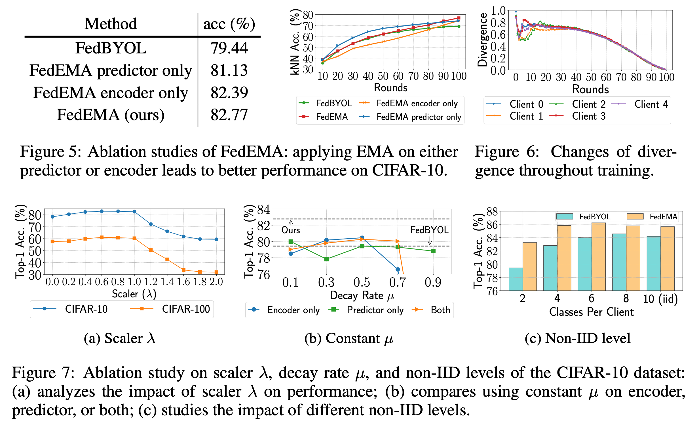

# Divergence-aware Federated Self-Supervised Learning [Eng]

##  1. Problem definition

This paper tackles federated learning problems when there is no labels in local data, which we call such scenarios as federated self-supervised learning (FedSSL). In this **problem definition** section, I first formally define the standard *federated learning* and then describe *federated self-supervised learning* to help your better understanding for this work. Note that the task tackled in this paper is the image classification, and thus I also describe the formal definition based on the image classification task. I use the same notation as the author used.

**Federated Learning**: Federated learning aims to learn the global model while collaboratively train multiple models on local data without sharing their data but communicating their locally-learned knowledge. In federated learning scenario, the dataset  $$\mathcal{D}=\{\textbf{X}_i, \textbf{y}_i\}_{i=1}^{n}$$, where $$\textbf{X}$$ is an image and $$\textbf{y}$$ is a corresponding label, and $$n$$ is the number of total data instances, is partitioned into $$K$$ number of clients, $$\mathcal{D}_k=\{\textbf{X}_j, \textbf{y}_j\}_{j=1}^{n_k}$$ such that $$\cup\{\mathcal{D}_k\}_{k=1}^{K}=\mathcal{D}$$ and $$\cap\{\mathcal{D}_k\}_{k=1}^{K}=\emptyset$$, where $$n_k$$ is the number of data for client $$k$$. Then, each client $$k$$ learns on the partition $$\mathcal{D}_k$$ while minimizing its loss function $$f_k(w_k):=\mathbb{E}_{x_k\sim\mathcal{P}_k}[\tilde{f}_k(w_k; X_{\mathcal{D}_k},\textbf{y}_{\mathcal{D}_k})]$$, where $$w$$ is model weights, $$\mathcal{P}_k$$ is data distribution, and the loss function is in general the standard cross-entropy function. When the local training is done, clients send their local updates to the server (local updates can be either their updated weights or gradients depending on the algorithms). Server then aggregates local updates based on global objective as $$\textrm{min}_w f(w) := \sum_{k=1}^{K} \frac{n_k}{n} f_k(w_k)$$, and distributes the updated model to clients for the next round training.

**Federated Self-Supervised Learning**: Federated self-supervised learning is a scenario where there does not exist any labels on local data. In this scenario, the data is now unlabeled such that $$\mathcal{D}=\{\textbf{X}_i\}_{i=1}^{n}$$, and the unlabeled dataset is split into $$k$$ partitions, $$\mathcal{D}_k=\{\textbf{X}_j\}_{j=1}^{n_k}$$, $$\cup\{\mathcal{D}_k\}_{k=1}^{K}=\mathcal{D}$$, and $$\cap\{\mathcal{D}_k\}_{k=1}^{K}=\emptyset$$. Then, each client $$k$$ learns on the unlabeled partition $$\mathcal{D}_k$$ while minimizing its loss function $$f_k(w_k):=\mathbb{E}_{x_k\sim\mathcal{P}_k}[\tilde{f}_k(w_k; X_{\mathcal{D}_k})]$$, where the loss function is either contrastive or non-contrastive loss for self-supervised representation learning. When the local training is done, clients send their local updates to the server. Server then aggregates local updates based on global objective as $$\textrm{min}_w f(w) := \sum_{k=1}^{K} \frac{n_k}{n} f_k(w_k)$$, similarly to the standard federated learning scearnios.

## 2. Motivation

The motivation of this paper is to properly perform represenation learning on decentralized unlabeled data while preserving privacy of local data. In real-world scenarios, local data is often obtained without any supervision, e.g. photos from mobile phones, due to the the expensive labeling costs or the exhaustive time consumption, but most existing federated learning methods tackle learning on labeled data in a supervised learning fashion, and there have not yet been active studies for learning representations from unlabeled local data. Thus, the authors first naively apply the current state-of-the-art self-supervised learning methods, i.e. Siamese networks, to the federated learning scenarios and examine the effect of the naive approaches. Based on their observation, the authors propose their novel method to handlethe federated self-supervised learning and validate their method on the image classification benchmark datasets.

### Related work

The authors well-organize the related works into the three broad sections, which are self-supervised learning, federated learning, and federated unsupervised learning, and pros and cons of each work are properly summarized.

**Self-Supervised Learning**: The authors introduce the contrastive learning methods (Oord et al., 2018; Bachman et al., 2019), which become promising principle that uses Siamese networks to maximize the similarity of differently augmented views from the same images (positive pairs) while minimizing that of the different images (negative pairs). To be more specific, there are two strategies which are the *contrastive self-supervised learning* (Chen et al., 2020; He et al., 2020) that requires negative paris, which are computationally heavy, and *non-contrastive self-supervised learning* (Grill et al., 2020; Chen & He, 2021) that uses only positive pairs and is considered as more efficient while showing remarkable performance. 

**Federated Learning**: The authors first introduce the well-known federated learning algorithm Federated Average (FedAvg) (McMahan et al., 2017) which perform weighted averaging of locally learned weights. While most prior works tackle the conventional supervised federated learning scenarios, some works have proposed semi-supervised learning methods for federated learning scenarios where the labels are not fully available at local data (Jin et al. 2020; Jeong et al. 2021). However, they still require a small set of labeled data.

**Federated Unsupervised Learning**: Recently, a few works have focused on such extreme scenarios in federated learning where labeled data is completely not available at local data. Berlo et al. (2020) first proposed a federated unsupervised learning methods based on autoencoder, but the method does not tackle the local heterogeneity, i.e. non-iid tasks (non-independent and identical distribution). Although Zhang et al (2020) proposed a method to tackle such non-iid problems, their method has potential risk to share the local features which violates the privacy preservation in federated learning scenarios. 

### Idea

The main idea of this work is to adopt BYOL based learning algorithm which uses two networks, namely online and target networks, and share only online networks with other clients while keeping target networks locally. In this way, online networks can learn global knowledge across all clients and the target networks can keep the local knowledge to handle the local heterogeneity (non-iid). Further, when updating online networks, they consider exponential moving average (EMA) of the global network, where the decay rate is measured by the divergence of global and local online model dynamically.

## 3. Method

### Generalized Framework

The authors first applies the existing self-supervised learning methods, which is based on Siamese networks, to the federated learning scenarios, and they call the naively combined algorithms as *generalized framework*. Figure 1 represents the overview of the generalized federated self-supervised learning framework.

**Local Training**:  Each client has the online model $$W_k^o$$ and the target model $$W_k^t$$. At initial time, the online model is initialized by the global online model $$W_g^o$$ transmitted from the server and each client trains the two models based on loss function $$\mathcal{L}$$. Depending on the algorithms, the online networks contain the prediction layers, i.e. $$W_k^o=(W_k, W_k^p)$$, (SimSiam and BYOL), or the online and target models can be identical, i.e. $$W_k^t$$  = $$W_k$$ (SimSiam and SimCLR). For MoCo and BYOL, target encoder is updated by EMA of the online model, s.t. $$mW_k+(1-m)W_k^t$$, where $$m$$ is the momentum value.

**Model Communication & Aggregation**: Considering the difference of algorithms, the authors decide to share only online encoder $$W_k^o$$ when the online and target models are non-identical, as well as the prediction layers when it presents in local training. The updated global model is obtained by $$W_g^o=\sum_{k=0}^K W_k^o$$ .

### Analysis of the Generalized Framework 

Before introducing the proposed method, the authors first analyze the effect of the naive combined algorithms introduced above to figure out the hidden weakness of the generalized framework.

**Experimental setup for analysis**: they use CIFAR-10 and CIFAR-100 datasets and split them into $$K=5$$ partitions in a non-iid manner to simulate label heterogeneous scenarios in federated learning. They use ResNet-18 networks as backbone networks and train for $$R=100$$ rounds and $$E=5$$ local epochs. The use linear evaluation for algorithm comparison which train a linear classifier on the frozen representations. They compare the naive combined federated self-supervised learning methods, which are Fed-SimCLR, Fed-MoCoV1, and Fed-MoCoV2 for the contrastive learning based algorithms and Fed-SimSiam and Fed-BYOL for the non-contrastive learning based algorithms.

**Comparison of Generalized Frameworks **: Table 1 shows comparison of the generalized frameworks based on linear evaluation under non-iid partition of the CIFAR-10/100 datasets. Against the common expectation, which SimSiam shows better performance over contrastive learning algorithms on centralized datasets, Fed-SimSiam shows the worst performance on such distributed learning scenarios. Fed-BYOL shows the best performance compared to contrastive learning based algorithms even with less computation costs (using only positive pairs).

**Analysis on Non-Contrastive Methods**: As Fed-BYOL shows the best performance with the highest efficiency, the authors decide to focus on further exploring non-contrastive methods to figure out the impact of components inside the methods in federated learning scenario, such as Predictor, Stop-gradient, and Exponential Moving Average (EMA).

* **Predictor**: Figure 2 shows that predictor is essential on decentralized learning. Without predictors, both Fed-SimSiam and Fed-BYOL fail to learn representations. 
* **Stop-Gradient**: As shown in Figure 2, Fed-BYOL without stop-gradient still show competitive performance while Fed-SimSiam is degenerated significantly. Thus, stop-gradient is not a significantly important factor for Fed-BYOL since Fed-BYOL uses two different networks and online networks keep updated by global updates, unlike SimSiam based algorithms which shares the weights.
* **Exponential Moving Average (EMA)**: The authors observe the EMA helps improve model performance as shown in Figure 3. For the worst two cases, the target encoder is never updated, while it can be updated in the best two cases, meaning that updating the target network is crucial to provide contrastive targets. 

### Divergence Aware Dynamic Moving Average Update

Based on the above observation, the authors adopt Fed-BYOL as baseline since it contains all crucial components for federated self-supervised learning. The authors improve and optimize the model update operations and propose Federated Divergence-aware EMA update, namely FedEMA, particularly for tackling non-IID data challenges.

**Intuition of FedEMA**: The intuition of FedEMA is to obtain more local knowledge when divergence between global and local online models become large and incorporate more global knowledge when the divergence become small. For non-IID settings, keeping more local knowledge is more effective and beneficial when model divergence is large. Conversely, when the divergence is small, obtaining more global knowledge improves the generalization ability. 

**Methodology:** While Fed-BYOL which replaces the online network with the global network, FedEMA leaverages EMA of global network when updating the online network. The decay rate of EMA is dynamically measured by model divergences. Followings are formal definition of FedEMA.

* **Model Update:** FedEMA updates its online model via $$W_k^r=\mu W_k^{r-1}+(1-\mu)W_g^r$$, where $$r$$ is communication round, $$\mu$$  is the decay rate measured by the divergence between global and local online encoders.  Similarly to the online model, predictor is also updated via $$W_k^{p,r}=\mu W_k^{p,r-1}+(1-\mu)W_g^{p,r}$$.
* **Measuring Divergence $$\mu$$**: The divergence $$\mu$$ can be calculated by minimum value between 1 and the difference between the global model and the local model, such that $$\mu=\textrm{min}(\lambda||W_g^r-W_k^{r-1}||,1)$$ , where $$\lambda$$ is the scaler for divergence. 
* **Personalized Autoscaler $$\lambda$$**: The authors propose the autoscaler to measure the personalized scaler $$\lambda_k$$ for each client, such that $$\lambda_k=\frac{\tau}{||W_g^{r+1}-W_k^r||}$$, where $$\tau\in[0,1]$$ is the expected value of $$\mu$$ at round $$r$$.

The authors provide the pseudo-code algorithm of FedEMA (in Algorithm 1) and the overall workflow illustration of FedEMA (in Figure 4) for helping better understanding.

## 4. Experiment & Result

### Experimental setup

**Datasets:** The authors use CIFAR-10 and CIFAR-100 for their main experiments. Both contains 50,000 training images and 10,000 test images while CIFAR-10 has 10 classes and CIFAR-100 has 100 classes. They split the datasets into $$K$$ partitions (it defers depending on the experiments) while assigning different number of classes $$l$$ to each client, where $$l=\{2,4,6,8,10\}$$ for CIFAR-10 and $$l=\{20,40,60,80,100\}$$ for CIFAR-100. 

**Baselines:** The authors use five baseline models: 1) **Stand-alone**: local training model without knowledge sharing, 2) **FedCA** proposed in Zhang et al. (2020a), 3) **FedBYOL** as described above, and 4)**FedU** proposed in Zhuang et al. (2021a). As upper bound, they use 5) **BYOL** trained on centralized data.

### Result

**Linear Evaluation**: Table 3 shows that top-1 accuracy comparison on CIFAR-10 and CIFAR-100 datasets. As shown, their proposed method, FedEMA, outperforms all other methods on different settings (approximately 3% higher), regardless using either constant scaler ($$\lambda=0.8$$) or autoscaler with $$\tau=0.7$$. 

##### Ablation Study

* **Ablation of FedEMA**: they apply EMA updates to either predictor or online encoder and the results are shown in Figure 5. Applying the EMA updates improves both ablated models compared to the FedBYOL which does not have any EMA updates. 
* **Analysis of Divergence**: Figure 6 shows changes of divergence between global and local online model throughout training. The divergence is high when earlier training stage but it decreases as training proceeds, meaning that FedEMA well-balances the divergence between the two models.
* **Scaler $$\lambda$$**: Figure 7 (a) show the impact of scaler $$\lambda$$ varying the values in a range of [0,2]. Setting $$\lambda>1$$ leads to significant performance drop since it results in $$\mu=1$$ that makes the global model not used at all.
* **Constant $$\mu$$**: As shown in Figure 7 (b), FedEMA with constant EMA still outperforms FedBYOL when EMA is applied to both online and predictor networks or encoders only when the constant value is in a range of [0.3, 0.5]. However, using constant EMA value underperform the model with dynamic EMA. 
* **Non-IID Level**: Figure 7 (c) shows the performance comparison on different level of non-iid settings. FedEMA consistently outperform FedBYOL regardless the number of classes per client. 

## 5. Conclusion

The authors explored and analyzed the effect of contrastive/non-contrastive learning algorithms when the methods are naively applied to federated learning scearnios. Also, they proposed a method, FedEMA, which is simple-yet-effective and outperforms the baseline approaches on non-iid data.

There exist both weakness and strength for this work. The weakness of this paper is that they used only CIFAR-10 and CIFAR-100 for their analysis, which is insufficient. Experiments on larger datasets, i.e. Tiny-Imagenet, may further strengthen their paper. 

The strength of the paper is the novelty regarding the research topic. Even though there exist a few works to tackle federated self-supervised learning, this work well-analyze and organize the effect of contrastive/non-contrastive algorithms on decentralized settings in relatively earlier stage where the topic is rapidly emerging.

### Take home message \(오늘의 교훈\)

The authors of this work did not hesitate to dive into the emerging research topic (federated self-supervised learning) and share valuable analysis and method. Working on very new topic is often considered as risky but I personally think your braveness would make you a pioneer.

## Author / Reviewer information

### Author

**정원용 \(Wonyong Jeong\)** 

* KAIST AI 
* Ph.D student who is interested in Federated Learning, AutoML, etc.
* wyjeong@kaist.ac.kr

### Reviewer

1. Korean name \(English name\): Affiliation / Contact information
2. Korean name \(English name\): Affiliation / Contact information
3. ...

## Reference & Additional materials

1. Zhuang et al., Divergence-aware Federated Self-Supervised Learning, ICLR 2022.
2. Oord et al., Representation Learning with Contrastive Predictive Coding, arXiv:1807.03748.
3. Bachman et al., Learning Representations by Maximizing Mutual Information Across Views, arXiv:1906.00910.
4. Chen et al., A Simple Framework for Contrastive Learning of Visual Representations, ICML 2020.
5. He et al., Momentum Contrast for Unsupervised Visual Representation Learning, CVPR 2020.
6. Grill et al., Bootstrap your own latent - a new approach to self-supervised learning, NeurIPS 2020.
7. Chen & He, Exploring simple siamese representation learning, CVPR 2021.
8. McMahan et al., Communication-Efficient Learning of Deep Networks from Decentralized Data, AISTATS 2017
9. Jin et al. A Survey towards Federated Semi-supervised Learning, arXiv:2002.11545.
10. Jeong et al., Federated semi-supervised learn- ing with inter-client consistency & disjoint learning, ICLR 2021.
11. Berlo et al., Toward federated unsupervised representation learning, ACM Workshop 2020.
12. Zhang et al., Federated unsupervised representation learning, arXiv:2010.08982 (2020a)
13. Zhuang et al., Collaborative unsuper- vised visual representation learning from decentralized data, ICCV 2021 (2021a)

