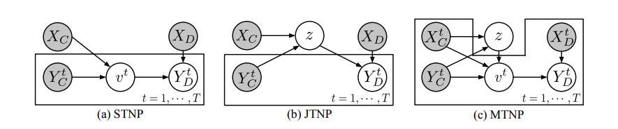
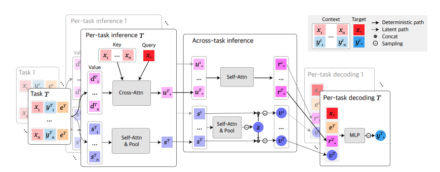
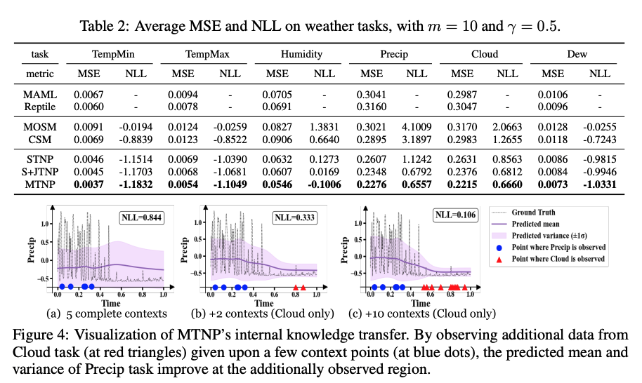

# _Multi-Task Neural Processes [Kor]_

### _Multi-Task Neural Processes [Kor]_

##  1. Problem definition

Neural Processes (NPs)는 함수의 분포를 모델링 (예: 확률 프로세스)하는 메타 러닝 계열의 방법론 중 하나이다. NPs은 내재되어 있는 확률 프로세스로부터 구현된 함수를 하나의 task로 고려하여 보지않은 task에 함수의 추론과정을 통해서 adapt할 수 있다. 이러한 특성 때문에 image regression, image classification, time series regression 등 다양한 도메인에 활용되어 왔다. 해당 논문에서 저자들은 기존의 neural processes를 다중 태스크 환경으로 확장하여 방법론을 소개하였다. 이 때 다중 태스크 환경은 다중의 확률 프로세스로부터 구현된 상관 관계의 태스크로 구성되어있다. 다중 태스크 환경은 의료 데이터나 기상 데이터와 같이 환자나 지역에 관한 정보가 다양한 상관 관계가 있는 특성을 가진 정보로 구성되어 있는 것과 같이 많은 실세계의 데이터가 다중의 상관관계의 함수들을 표현한다는 점에서 중요한 학습 환경이다. 그리고 기존의 neural processes 계열의 방법론은 다중 함수의 셋을 공동으로 다루고 있지 않고 이들 간의 상관 관계의 정보도 얻을 수 없는 구조로 되어 있다는 점에서  다중 학습 환경으로의 neural processes의 확장은 깊은 의미를 가진다고 생각된다.

## 2. Motivation

### Related work

**다중 태스크 학습을 위한 확율 프로세스** 다중 태스크 학습을 타켓으로 하는 기존의 확률 프로세스 기반의 모델로는 대표적으로 Multi-Output Gaussian processes (MOGPs)가 있는데 이는 기존의 Gaussian 프로세스를 확장하여 다중 태스크를 추론 하고 불완전한 데이터도 활용할 수 있다는 장점이 있다. 하지만 정확한 예측 성능을 위해서는 많은 관찰 값이 필요한 한계가 있다. 최근의 방법론 중에는 Gaussian 프로세스와 메타학습 기번을 결합한 방법론이 있지만 이는 다중 학습 환경을 고려하지는 않았다. Conditional Neural Adaptive Processes (CNAPs)는 다양한 셋의 클래스를 고려하는 general 한 분류 모델을 제안했지만 NP와 마찬가지로 각 태스크에 대해 독립적인 추론만 가능하고 추론 시에 태스크 간의 상관 정보를 explicit하게 고려하지 못한다는 한계가 존재한다.

**Neural process 계열의 계층적 모델** Attentive Neural Processes (ANPs)는 어텐션 메카니즘을 deterministic에 통합하여 각각의 target example에 대해 추가적인 context 정보를 확보할 수 있게 하였고 이는 모델의 성능 향상과 underfitting 문제를 방지하게 해주었다. 유사한 방법으로는 local 잠재 변수를 활용하여 example에 특화된 stochasticity를 통합하여 NP의 그래픽 모델을 계층적인 구조로 확장하게 하는 방법도 존재한다.

### Idea

다중 환경에서의 다중 함수의 셋을 공동으로 학습하고 태스크 간의 상관 관계의 정보도 학습하는 시나리오에서 도전 과제 중 하나는 관찰 값들이 불충분 할 수 있다는 부분이다. 예를 들어 여러 센서에서 multi-modal 형태의 시그널을 수집할 때, 센서는 동시에 존재하지 않는 (asynchronous) 샘플링 비율을 가질 수 있다. 다시 말하면, 모든 함수들이 공통적인 샘플 location을 가지지 않을 수 있는데 저자들은 이러한 불충분한 데이터의 활용도를 최대화하기 위해서 이상적인 학습 모델은 서로 다른 인풋에서 관찰될 수 있는 여러 함수들을 연관지어 학습할 수 있어야한다고 제안하였다. 기존의 다변량 가우시안 프로세스 방법론이 이러한 방법으로 불충분한 관찰값을 가지고 다중 함수를 추론하는 것이 가능하지만 일반적으로 데이터 사이즈에 따른 복잡도가 높아져 이를 줄이기 위해 추정 방법을 추가로 필요로 하게 된다. (그리고 적합한 kernerl을 선택할 수 있는 여부에 성능이 크게 의존적인 편이다.)

이에 대해 저자들은 불충분한 데이터를 가지고 다중 태스크를 공동 모델링할 수 있는  Multi-task neural processes (MTNPs)를 제안하였다. 첫 번째로, 불충분한 데이터를 다루고 함수들을 통해 공동 추론을 하기 위한 다중 함수 공간을 디자인하였고 통합된 함수 공간에서 확률 프로세스를 이론적으로 유도하기 위한 잠재 변수 모델 (Latent variable model)을 정의하였다. 이 때, 태스크 간의 상관 관계 활용을 위해서 잠재변수 모델을 계층적으로 구성하였는데 이는 모든 태스크의 정보를 확보하기 위한 1) global latent variable과 각각의 테스크에 집중된 정보를 확보하기 위한 2) task-specific latent variable로 되어있다. 제안된 모델은 또한 기존의 neural processes가 보여주는 장점들(flexible adaptation, scalable inferece, uncertainty-aware prediction)을 여전히 가지고 있다.

## 3. Method

Neural processes 를 다중 태스크에 적용하는 직관적인 방법은 태스크 간의 독립성을 가정하고 함수 공간 $(y^1)^\mathcal{x}, ..., (y^T)^\mathcal{x}$ 에 대한 독립적인 NPs를 정의하는 것이다. Single-task neural processes (STNPs, Figure (a))로 명명하였다. 독립적인 잠재 변수 $v^1, v^2,...,v^T$에서 각각의 $v^t$는 태스크 $f^t$를 나타낸다. 

$$
p(Y_D^{1:T}|X_D, C)=\prod_{t=1}^{T} \int p(Y^t_D|X_D, v^t)p(v^t|C^t)dv^t.
$$

이 때, STNP는 각 태스크에 특화된 데이터 $C^t$ 에 대해 조건화를 통해  불충분한 관찰 값 (contexts)을 다룰수 있게된다. 하지만 다중 태스크의 결합 분포에서 존재하는 태스크 사이의 복잡한 상관 관계를 무시하고 주변 분포에 대한 모델링만 가능하다는 점에서 단점이 존재한다.

다른 대안으로는 출력 공간을 product space $\mathcal{Y}^{1:T} = \prod_{t\in\tau}\mathcal{Y}^t$ 결합하여 함수 공간 $(\mathcal{Y}^{1:T})^\mathcal{X}$ 에 대한 하나의 NP를 정의하는 것이다. 이 경우에는 한 개의 잠재 변수 $z$가 전체 태스크 $T$를 공동으로 포함하고 Joint-Task Neural Processes (JTNPs)라 명명한다.

$$
p(Y_D^{1:T}|X_D, C)= \int p(Y^{1:T}_D|X_D, z)p(z|C)dz.
$$

이 때, JTNP는 잠재 변수 $z$를 통해 전체 태스크 간의 상관 정보를 포함할 수 있다. 하지만 문제는 학습과 추론 시에 완전한 관찰값 context와 target 값을 필수적으로 필요로 한다.

#### Multi-Task Neural Processes 

위에서 언급된 문제 (완전한 데이터를 필요로 하는)를 극복하기 위해서 저자들은 기존의 JTNP의 형태를 재공식화 하여 다음과 같이 표현한다: $h: \mathcal{X} \times \mathcal{\tau} \rightarrow \bigcup_{t\in\tau}\mathcal{Y}^t$. 이러한 union form을 사용함으로써 어떤 부분적인 출력 값의 set도 $\{y_i^t\}_{t\in\tau}$ 다른 입력 포인트 $(x_i, t),t\in\tau_i$에서 타당한 값이 되기 때문에 불충분한 데이터를 효과적으로 사용할 수 있게 된다. 

Figure 1의 (c)에서 처럼 계층적인 잠재 변수 모델을 정의하는데 있어서 global한 잠재변수 $z$ 전체 context인 $C$를 사용하여 다중 태스크에 걸친 공유된 확률적인 요소를 확보할 수 있게 하였고, 각 태스크에 집중된 확률적 요소는 $C^t, z$를 사용하여 태스크에 집중된 (task-specific) 잠재 변수 $v^t$에 의해 다음과 같이 확보되게 하였다.

$$
p(Y_D^{1:T}|X_D, C)= \int \int [\prod_{t=1}^T p(Y^{T}_D|X_D^T, v^t)p(v^t|z, C^t)]p(z|C)dv^{1:T}dz.
$$

이 때, $v^{1:T}:= (v^1,..,v^T)$이고 $p(Y_D^t|x_D^t, v^t)$에 대한 조건적인 독립성을 가정한다. 

정리를 해보면 우선 전체 $v^{1:T}$에 따른 $z$를 공유함으로써 해당 모델은 태스크간의 상관 정보를 확보하기 이를 효율적으로 활용할 수 있게 된다. 그리고 global 잠재 변수 $z$를 통해 불충분한 데이터를 충분히 활용할 수 있게 되는데 이는 이 잠재변수가 1) 전체 context 데이터 $\bigcup_{t\in\tau}C^t$에서 추론되며 2) 각 테스크에 특화된 잠재변수 $v^t$를 추론할 때도  global 잠재 변수 $z$가 조건화되기 때문에 이는 $v^t$에 유도된 각각의 함수 $f^t$가 현재 태스크의 $C^t$ 뿐만 아니라 다른 태스크 $C^{t\prime}$에서의 관찰 값들도 범용적으로 활용할 수 있게되기 때문이다. 

학습과 추론시에 저자들은 encoder $q_\phi$와 decoder $p_\theta$를 사용하여 conditional prior와 generative 모델을 추정하였다. 언급된 다음의 식은 $p(Y_D^{1:T}|X_D, C)= \int \int [\prod_{t=1}^T p(Y^{T}_D|X_D^T, v^t)p(v^t|z, C^t)]p(z|C)dv^{1:T}dz$은 intractable하기에 variational lower bound을 통해 훈련을 진행한다.

$$
log p_\theta(Y_D^{1:T}|X_D^{1:T}, C) \geq \mathbb{E}_{q_{\phi}(z|D)}[\sum_{t=1}^T \mathbb{E}_{q_{\phi}(v^t|z,D^t)}[logp_{\theta}(Y_D^t|X_D^t, v^t)] - D_{KL}(q_\phi(v^t|z, D^t)||q_\phi(v^t|z, C^t))] - D_KL(q_\phi(z|D)||q_\phi(z|C))
$$

논문에서는 기존의 Attention Neural Process (ANP) 모델 구조를 활용하여 implementation을 진행하였고 모델의 구조는 위의 Figure 2와 같다.

## 4. Experiment & Result


If you are writing **Author's note**, please share your know-how \(e.g., implementation details\)


This section should cover experimental setup and results.  
Please focus on how the authors of paper demonstrated the superiority / effectiveness of the proposed method.

Note that you can attach tables and images, but you don't need to deliver all materials included in the original paper.

### Experimental setup

**데이터셋** 저자들은 총 세개의 데이터 셋 (synthetic & real-world 데이터셋)으로 MTNP를 검증하였고 모든 실험에서 context 데이터는 불충분하게 구성한 후 실험을 진행하였다. 

**베이스라인 모델과 학습 환경** MTNP 모델의 비교군으로 저자들이 방법론에서 언급한 STNP와 JTNP 모델을 ANP를 기반으로 설계하여 구성하였다. JTNP 모델은 불완정한 데이터를 처리할 수 없기에 missing label은 STNP를 통해 imputation을 진행하였다. 1D regreesion task에서는 추가적으로 두 개의 Multi-output Gaussian processes 베이스 라인 모델 (CSM, MOSM)과 두 개의 메타 학습 베이스라인 모델 (MAML, Reptile)과 성능을 비교하였다. 

**검증 메트릭** Regression 태스크에서는 mean squared error (MSE)로 성능 측정을 하였고 image completion 테스크에서는 pseudo-lbael과 prediction 값의 error를 MSE와 mIoU로 측정하였다.

### Result

총 세 개의 데이터 셋으로 주요 실험과 ablation 실험을 진행하였고 대표적으로 날씨 데이터를 활용한 1D 시계열 regression 태스크 결과를 기반으로 설명을 진행하겠다.

해당 실험의 데이터 셋은 266 개 도시의 258일 간의 수집된 날씨 기록으로 구성되어 있고 총 12개의 날씨 관련 attribute 정보 (고온, 저온, 습도, 구름 양 등)를 가지고 있다. 위의 figure에서 table 2는 정량적 실험결과를 보여주고 있는데 논문에서 제시된 MTNP 모델이 베이스라인 모델에 비해 정확도와 불확실성 추정 측면에서 높은 성능을 보여주는 것을 알수 있다. 이는 실제 데이터에서 제시된 모델이 효과적으로 일반화 됨을 보여준다. 또한, figure 4에서는 불충분한 데이터 환경에서 MTNP 모델이 테스크 간 지식 전이 (knowledge transfer)를 효과적이게 수행하는 것을 보여준다. figure (a)에서 관찰값이 적을 시에 불확실성이 높아지면서 높은 NLL 수치를 보여주지만 점차적으로 추가적인 관찰 값 (Cloud) 을 통해 지식 전이가 효과적으로 진행되어 예측 성능이 높여주는 것을 볼 수 있다. 

## 5. Conclusion

제시된 확률 프로세스 기반의 MTNP은 불충분한 데이터 환경에서 다중 함수를 효과적으로 추론할 수 있게 고안되었고 다양하게 디자인된 실험을 통해 모델의 성능을 입증하였다. Large scale 데이터 셋 환경에서 성능을 검증이 좋은 연구 방향이 될 것이라 생각되고 관찰되지 않은 공간에 대해 일반화를 진행하는 방향도 모델의 범용성을 향상 시키는데 도움이 될 것이라 생각된다. 

### Take home message \(오늘의 교훈\)

> Neural Processes (NPs)는 위대하다.
>
> 연구자님들 수고하셨습니다.

## Author / Reviewer information

### Author

*   허자욱
*   School of Computing
*   jayheo@kaist.ac.kr

### Reviewer

1. Korean name \(English name\): Affiliation / Contact information
2. Korean name \(English name\): Affiliation / Contact information
3. ...

## Reference & Additional materials

1. Kim, Donggyun, et al. "Multi-Task Processes." *arXiv preprint arXiv:2110.14953* (2021).
2. Caruana, Rich. "Multitask learning." *Machine learning* 28.1 (1997): 41-75.
3. Fortuin, Vincent, Heiko Strathmann, and Gunnar Rätsch. "Meta-learning mean functions for gaussian processes." *arXiv preprint arXiv:1901.08098* (2019).
4. Peyman Bateni, Raghav Goyal, Vaden Masrani, Frank Wood, and Leonid Sigal. Improved few-shot visual classification. In CVPR, 2020.
5. Chelsea Finn, Pieter Abbeel, and Sergey Levine. Model-agnostic meta-learning for fast adaptation of deep networks. In ICML, 2017.
6. Marta Garnelo, Dan Rosenbaum, Christopher Maddison, Tiago Ramalho, David Saxton, Murray Shanahan, Yee Whye Teh, Danilo Rezende, and SM Ali Eslami. Conditional neural processes. In ICML, 2018a.
7. Kiyosi Itô et al. An Introduction to Probability Theory. Cambridge University Press, 1984.

