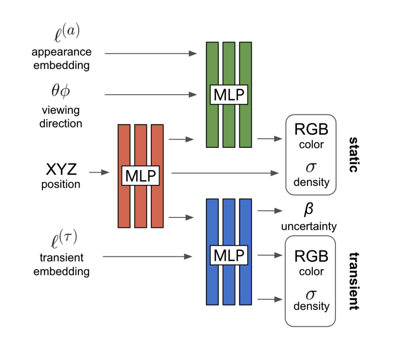
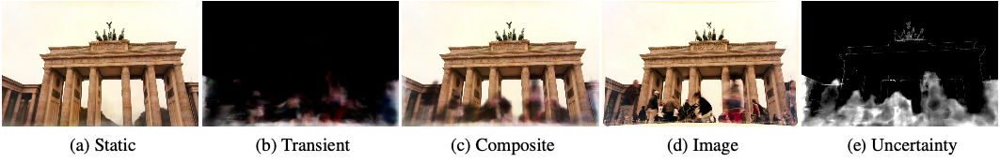
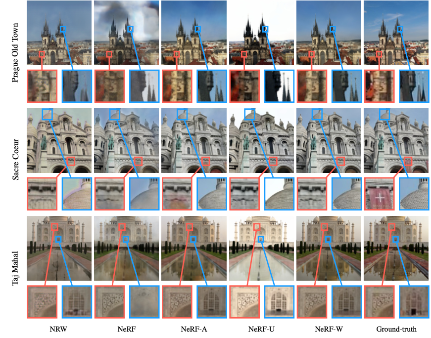
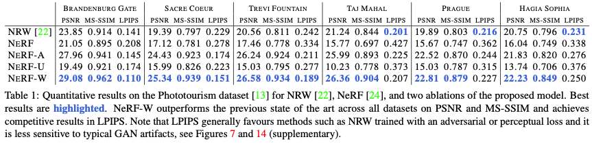

# NeRF in the Wild: Neural Radiance Fields for Unconstrained Photo Collections \[Kor\]

##  1. Problem definition
본 논문은  2020년 발간된  Mildenhall et al. 의 NeRF: Representing Scenes as Neural Radiance Fields for View Synthesis을 기본으로 하여, 기본 모델보다 더 unstructured 한 데이터 셋에서도 훈련될수 있게 합니다. 여기서 NeRF란 neural volumen rendering 테크닉의 연장선에 있어, 구도가 다른 사진들로부터 새로운 구도의 사진을 도출하는 것(Novel View Synthesis)이 최종 목적입니다. 기존에 있던 NeRF는 깔끔한 데이터셋 (예를 들어 조명이 일정하거나 사진과 사진 사이의 구조적 차이가 크지않은)에서는 훈련이 쉬우나 temporary artifacts 혹은 다른 조명 컨디션이 소개되는 순간 퍼포먼스의 큰 하향성을 보여줍니다.

수식으로서 두 아키텍쳐의 차이점을 나타내자면, 오리지널 NeRF는 
$$
\begin{gathered}
\hat{\mathbf{C}}(\mathbf{r})=\mathcal{R}(\mathbf{r}, \mathbf{c}, \sigma)=\sum_{k=1}^{K} T\left(t_{k}\right) \alpha\left(\sigma\left(t_{k}\right) \delta_{k}\right) \mathbf{c}\left(t_{k}\right)\\

\text{where} T\left(t_{k}\right)=\exp \left(-\sum_{k^{\prime}=1}^{k-1} \sigma\left(t_{k^{\prime}}\right) \delta_{k^{\prime}}\right)
\end{gathered},
$$

여기서 $\hat{\mathbf{C}}$ 란 카메라 레이 $\mathbf{r}$ 을 인풋으로 삼아 아웃풋으로는 이 카메라 레이의 샘플링 디스트리뷰션 $\mathbf{K}$에 따른 expected color입니다. NeRF-W에서는 여기에서 transient modelling head를 추가 하게 되는데 이는

$$
\hat{\mathbf{C}}_{i}(\mathbf{r})=\sum_{k=1}^{K} T_{i}\left(t_{k}\right)\left(\alpha\left(\sigma\left(t_{k}\right) \delta_{k}\right) \mathbf{c}_{i}\left(t_{k}\right)+\alpha\left(\sigma_{i}^{(\tau)}\left(t_{k}\right) \delta_{k}\right) \mathbf{c}_{i}^{(\tau)}\left(t_{k}\right)\right)
$$
where \(T_{i}\left(t_{k}\right)=\exp \left(-\sum_{k^{\prime}=1}^{k-1}\left(\sigma\left(t_{k^{\prime}}\right)+\sigma_{i}^{(\tau)}\left(t_{k^{\prime}}\right)\right) \delta_{k^{\prime}}\right)\).

로 표현이 됩니다. 이 두 아키텍처의 유일한 차의점은 transient $\tau$의 유무 인데, 이는 모두 transient head의 아웃풋에서 비롯되는 변화입니다. 단순하게 생각해 보시면, $\sigma$ density vector의 값이 카메라 레이 선상 quadrature point인 $\left(t_{k}\right)$을 인풋으로 삼아 투명도를 결정하면, 이를 $\delta_{k}$ quadrature point 선상의 difference에 곱하고, 그리고 컬러 벡터 $\mathbf{c}_{i}$에 곱하게 됩니다. 이 프로세스는 $\tau$ 로 표시된 transient head 의 값들에도 동일하게 적용 됩니다. 이 값들이 어떻게 연산되는지는 3번 method 섹션에서 조금더 자세하게 다루게 됩니다. 

## 2. Motivation
앞에서도 설명했듯이, 이 논문의 주된 아이디어는 오리지널 NeRF에서 가져오되, 조금 더 unstructured 한 데이터셋을 이용할수 있도록 아키텍쳐를 조금 변경하는 것입니다. 여기서 unstructured 한 데이터에 대해 조금 더 얘기해 보자면, 기존의 NeRF는 NeRF를 훈련시키기 위한 특별한 데이터셋을 만들어야 했습니다. 예를들어, 선명해야하고, 사물의 크기는 데이터셋간에 일정했어야 했었고, 조명 컨디션, 그리고 임시적인 아티팩트 또한 일정해야 했었습니다. 이는 실험실에서 모델이 훈련되는데 아주 큰 도움을 줬지만 현실 세계에서 상용 되기에 모델이 적합하지 않게 만들었습니다. 실제로 인터넷에서 찾을 수 있는 사진들의 대부분은 원하는 모델링 상대가 가려지거나, 서로 조명이 다른 경우들이 많습니다. 그러므로, 이러한 diverse한 데이터셋에 맞는 새로운 아키텍쳐가 필요하게 된 것입니다.

### Related work

사실 NeRF 라는 테크닉은 2020년 Mildenhall et al. 의 NeRF: Representing Scenes as Neural Radiance Fields for View Synthesis가 발표되면서 확립된 분야입니다. 이 테크닉은 두갈래의 학문의 중첩점에 위치해 있는데, 이는 Novel View Synthesis와 Neural Rendering 입니다.

Novel View Synthesis 의 분야는 이 둘중 더 오래된 분야로, 여러가지 선행 연구들이 있는데, 이들 중 돋보이는 작업들은  light field photograph, image based rendering 등이 있습니다. 하지만 이들의 문제점은 보통 캡처해야하는 데이터의 양이 많다는 점 입니다. 그리고 이러한 데이터들을 수집하는 데에는 특수기기가 필요했습니다. Image based rendering의 경우 explicit 한 light source modeling이 필요합니다. 이 분야의 최근 연구들은 사진으로부터 빛과 그의 반사도를 측정하여 새로운 각도의 이미지를 아웃풋하는 테크닉도 생겨났습니다.

조금 더 최신에는 뉴럴 네트워크를 이용한 novel view synthesis가 활성화 되었습니다. 특히 이 페이퍼와 가장 비슷한 approach를 가진 논문은 Neural Rerendering in the Wild (NRW) 입니다. 이는 point-cloud 렌더링을 인풋으로 받아들여 사실주의적 이미지를 표출해주는 네트웍으로서, NeRF와는 다른 인풋, 같은 아웃풋을 가지고 있습니다. 이 방법의 가장 큰 문제점은 체커보드 패턴과 temporary artifacts들의 고스팅 현상등 입니다. 다음으로 나온, neural volumetric rendering은 이러한 문제들을 해결하고자 나왔습니다.

오리지널 NeRF 논문이 이중 하나이며, 이들은 volume을 직접적으로 모델이 학습한다고 하여 이름이 붙여졌습니다. 조금 더 자세히 말하면, 이 네트웍의 학습목적은 이미지 안에 내재되어 있는 볼륨, 즉 공간을 학습하는 것이라고 볼 수 있습니다. 바닐라 NeRF는 MLP 두개를 이용하여 radiance field를 학습하는데, 이전과는 화질이 현저희 선명해지는 차이를 볼 수 있으며, 이는 모델안에서 쓰이는 positional encoding에 의한 것이라고 볼수 있습니다. 이를 수식으로 표현해 보자면,

$$
\begin{aligned}
{[\sigma(t), \mathbf{z}(t)] } &=\operatorname{MLP}_{\theta_{1}}\left(\gamma_{\mathbf{x}}(\mathbf{r}(t))\right) \\
\mathbf{c}(t) &=\operatorname{MLP}_{\theta_{2}}\left(\mathbf{z}(t), \gamma_{\mathbf{d}}(\mathbf{d})\right)
\end{aligned}
$$

이는 즉슨, $\operatorname{MLP}_{\theta_{1}}$ 은 카메라 레이 정보 벡터 $\mathbf{r}(t)$에서 추출된 positional encoding vector $\gamma_{x}$ 를 인풋으로 받고 투명도 벡터 $\sigma$ 와 $\operatorname{MLP}_{\theta_{2}}$ 로 전달될 $\mathbf{z}$ 가 아웃풋 됩니다. $\operatorname{MLP}_{\theta_{2}}$ 에서는 $\operatorname{MLP}_{\theta_{1}}$ 에서 받은 $\mathbf{z}$ 와 더불어 viewing direction encoding $\gamma_{d}$ 를 인풋으로 받아 RGB 벡터 $\mathbf{c}(t)$를 추출하게 됩니다.

### Idea

하지만 자유로운 데이터셋을 수용할 수 있는 아키텍쳐를 만든다는 것은 말처럼 쉬운일이 아닙니다. 이를 위해 NeRF in the Wild - 줄여서 NeRF-W 로 부르기로 함 - 는 세개의 MLP를 제시합니다. 그리고 이 세개의 모델은 서로에게 latent vector들을 주고 받음으로서 세게의 아웃풋을 지니는데, 바로 static RGB Density, transient RGB Density, 그리고 uncertainty vector 입니다.

위의 사진에서 보이듯이, 세개의 Multi Layer Perceptron들은 서로의 아웃풋을 인풋으로 받기도 하고, 밖에서 임베딩 벡터 값을 전달받기도 합니다. 아웃풋에 더 가까운 두개의 MLP를 우리는 각각 permanent head, transient head라고 부르는데 둘다 RGB 값과 덴시티 값인 $\sigma$를 아웃풋 합니다. 첫번째 permanent head에서는 데이터셋 이미지들 사이에서 항상 존재하는 구조물들을 러닝하게 됩니다. 이와 반대로 transient head에서는 이미지간의 차이가 있는 구조물들을 러닝 하는데, 한가지 방금 permanent head와 다른 점은 트레이닝 타임에 uncertainty vector를 같이 아웃풋 하여 모델이 어떤 부분을 선택적으로 학습할것인가에 관해 스스로 힌트를 줍니다. 다만, 이 uncertainty vector는 테스트 혹은 인퍼런스 타임에는 추출되지 않습니다.

## 3. Method

이번 섹션에서는 NeRF-W 가 오리지널 바닐라 NeRF와 어떻게 다른지에 중점을 두고 설명해 보겠습니다.

오리지널과의 차이점은 크게 두가지로 나뉘어 지는데, 첫번째는 모델이 어떻게 Photometric variation을 처리하는가에 관한것이고, 둘째는 모델이 어떻게 transient object를 분리 시키는가에 관한 것입니다.

첫번째로 photometric variation이란, 이미지 특성의 artifacts 들을 말하는 것인데, 예를들어 똑같은 시간에 똑같은 앵글로 같은 장소에서 사진을 찍었다고 해도, 이미지 포스트 프로세싱에 따라 파이널 사진이 달라지는 경우가 있습니다. 인터넷에서 찾을수 있는 사진들은 거의다 사진기기의 기종이나 이러한 후처리에 따라 똑같은 컨디션이더라도 화이트 밸런스, 톤매핑 등의 특성이 다른 경우가 대부분 입니다. 따라서, 우리의 NeRF-W 가 단순한 이미지 후처리를 뛰어넘어 그 속의 공간을 학습하려면, 아키텍쳐 레벨에서 이러한 photometric variation을 인식할 메커니즘이 필요합니다. 우리는 이걸을 Latent Appearance Modeling이라고 부릅니다.

이는 Bojanowski et al. 의 Generative Latent Optimization (GLO)에서 착안한 것인데, 데이터셋 안의 모든 이미지에 appearance embedding vector $\ell$을 매기는 것입니다. 따라서, 우리는 오리지널 NeRF의 컬러계산법을 다음과 같이 업데이트 합니다.

\begin{gathered}
\hat{\mathbf{C}}_{i}(\mathbf{r})=\mathcal{R}\left(\mathbf{r}, \mathbf{c}_{i}, \sigma\right) \\
\mathbf{c}_{i}(t)=\operatorname{MLP}_{\theta_{2}}\left(\mathbf{z}(t), \gamma_{\mathbf{d}}(\mathbf{d}), \ell_{i}^{(a)}\right)
\end{gathered}

오리지널과 비교해보면 $\operatorname{MLP}_{\theta_{2}}$ 의 인풋에 $\ell_{i}^{(a)}$이 추가된 것을 볼 수 있습니다. 이는 앞에서 말해준 permanent head에 다이렉트하게 인풋 됩니다. 그래서 정확히 이 appearance embedding 이 무엇일까요? 만약에 $\operatorname{MLP}_{\theta_{2}}$의 모든 다른 인풋들이 안정되어 있다고 가정 한다면, $\ell_{i}^{(a)}$를 조정하는 것은 다음과 같은 결과를 낼 수 있습니다.

이미 Geometry는  $\operatorname{MLP}_{\theta_{1}}$ 에서 계산 되어있기 때문에, 공간의 왜곡 없이도 photometric variance 를 다시 줄 수 있게 되었습니다.

두번째로 transient objects들을 제거하기 위해서 앞에서도 말했듯이 NeRF-W 는 transient head를 제안합니다. 이 transient head에서 아웃풋된 RGB value 와 density $\sigma$를 permanent head 에서 아웃풋된 같은 값들과 다음과 같은 식으로 합칩니다.

$$
\hat{\mathbf{C}}_{i}(\mathbf{r})=\sum_{k=1}^{K} T_{i}\left(t_{k}\right)\left(\alpha\left(\sigma\left(t_{k}\right) \delta_{k}\right) \mathbf{c}_{i}\left(t_{k}\right)+\alpha\left(\sigma_{i}^{(\tau)}\left(t_{k}\right) \delta_{k}\right) \mathbf{c}_{i}^{(\tau)}\left(t_{k}\right)\right)
$$

오리지널과 달라진건 식의 transient head 값을 나타내는 두번째 파트인 $\alpha\left(\sigma_{i}^{(\tau)}\left(t_{k}\right) \delta_{k}\right) \mathbf{c}_{i}^{(\tau)}\left(t_{k}\right)$가 추가되었다는것입니다.  조금 더 쉽게 이해하기 위해서 이미지를 살펴 보도록 하죠.

이와같이 static head에서 나온 (a) 와 transient head에서 나온 (b)가 합쳐져서 composite image (c)를 만들어 냅니다. 학습시간에는 이 (c) 와 (d)의 difference 를 minimize하는것에 초점을 맞추는데, 이 difference 값을 (e) uncertainty variance로 곱한 값이 로스값이 됩니다.

그렇다면 여기서 나온 (e) uncertainty 값은 어떻게 계산이 될까요?

여기서 transient head 의 수식을 살펴보면 도움이 될것 같습니다.

\begin{gathered}
{\left[\sigma_{i}^{(\tau)}(t), \mathbf{c}_{i}^{(\tau)}(t), \tilde{\beta}_{i}(t)\right]=\operatorname{MLP}_{\theta_{3}}\left(\mathbf{z}(t), \ell_{i}^{(\tau)}\right)} \\
\beta_{i}(t)=\beta_{\min }+\log \left(1+\exp \left(\tilde{\beta}_{i}(t)\right)\right)
\end{gathered}

$\operatorname{MLP}_{\theta_{3}}$ 는 $\operatorname{MLP}_{\theta_{1}}$ 에서 받은 $\mathbf{z}(t)$ 값과 temporary embedding $\ell_{i}^{(\tau)}$ 를 받고 density vector, RGB value, 그리고 우리의 uncertainty matrix $\tilde{\beta}_{i}(t)$를 제공합니다.

앞에서는 단순히 "difference 값을 (e) uncertainty variance로 곱한 값이 로스값이 됩니다." 라고 했지만 사실 로스값은 조금 더 복잡하게 계산됩니다. 이 정확한 프로세스가 궁금하신분들은 다음 식을 참고하시기 바랍니다.

$$
L_{i}(\mathbf{r})=\frac{\left\|\mathbf{C}_{i}(\mathbf{r})-\hat{\mathbf{C}}_{i}(\mathbf{r})\right\|_{2}^{2}}{2 \beta_{i}(\mathbf{r})^{2}}+\frac{\log \beta_{i}(\mathbf{r})^{2}}{2}+\frac{\lambda_{u}}{K} \sum_{k=1}^{K} \sigma_{i}^{(\tau)}\left(t_{k}\right)
$$

## 4. Experiment & Result

### Experimental setup
NeRF-W 논문에서는 모든 실험을 the Brandenberg Gate dataset에 맞춰서 학습합니다. 모든 실험은 Tensorflow2 와 Keras 를 이용하여 진행되고 모든 hyperparameters들은 브랜든버그 게이트 데이터셋에 맞춰 PSNR값이 최대화 되도록 grid matrix search를 합니다. 비교대상들은 related works 섹션에서 나왔던 NRW, NeRF, 그리고 NeRF-W 에서 transient head를 뺀 NeRF-A, 그리고 NeRF-W에서 appearance embedding $\ell_{i}^{(a)}$를 제거한 NeRF-U(Uncertainty), 그리고 NeRF-A 와 NeRF-U 를 composite한 NeRF-W 이렇게 다섯가지 모델을 실험합니다. 
모든 NeRF 들은 batch size 2048에서 300,000 스텝동안 8개의 GPU와 Adam Optimizer를 사용하여 트레이닝합니다. 마지막으로 evaluation metric 으로는 PSNR, MS-SSIM, 그리고 LPIPS를 사용합니다. 

### Result

아마도 NeRF-W의 위력을 모두 이해하기 위해선 이미지를 보는것이 수치들을 보는것 보다 나을것이라고 생각됩니다.

먼저 NRW와 NeRF-W를 비교하자면, GAN based system 특유의 checkerboard artifact가 NRW에서 확인됩니다. 이는 NeRF-W에서 급격히 좋아진걸 볼 수 있습니다.

 오리지널 NeRF 의 렌더링들을 살펴보면 날씨나 시간 같은 temporary artifacts들이 끼친 영향을 확인할 수 있습니다. 특히 Prague Old Town 렌더링의 하늘을 보면 이 문제가 특히 심각한것을 알 수 있습니다. NeRF는 세상이 항상 static하다는 기본적인 전제조건을 가지고 있기 때문에 이러한 temporary artifacts들을 설명할 수 없는것을 확인할 수 있습니다. 
 
 NeRF-A의 렌더링들은 겉보기에는 괜찮으나 자세히 디테일을 확대해 보면 transient object를 설명하지 않는다는것을 볼 수 있습니다. 게다가 작은 디테일들은 무시해 버리는 경향이 눈에 띕니다. NeRF-U는 반대로, appearance embedding을 제거하여, 날씨와 같은 photometric variation이 드러나는 부분들을 아예 제거해 버린 모습을 볼 수 있습니다. 예를들어, 날씨나 시간을 가장 잘 드러내는 하늘의 색깔은 아예 하얀색으로 변한 모습을 볼 수 있습니다.

 그에비해, NeRF-W는 fine detail도 보존하면서 photometric appearances도 잘 재현한 모습을 보여줍니다. 흥미로운점은, Sacre Coeur의 ground truth 비교하면, 어떤 사진에는 있고 어떤 사진에는 없던 깃발을 아예 삭제해버린 모습을 볼 수 있습니다. 이는 아마도 NeRF-W가 깃발을 transient object로 인식, transient embedding에서 채택되지 않았을수 있습니다. 이는 transient embedding의 수정을 통해서 불러올 수도 있을듯 합니다. 

수치적 실험결과는 다음과 같습니다. 이번 paper review에서는 수치는 다루지 않을 것이나, 몇몇 Outlier들을 설명하자면, Taj Mahal,  Prague, 그리고 Hagia Sophia 데이터셋에서 LPIP score의 위너는 NRW인것을 보실수 있습니다. 이는 LPIPS 테스트의 checkerboard artifacts에 관한 둔감성으로 이해할 수 있을것 같습니다.

## 5. Conclusion

이리하여 오늘은 요즘 가장 핫한 NeRF, 그리고 그중에서도 unstructured dataset을 학습할수 있는 NeRF-W를 살펴보았습니다. 

NeRF-W는 기존 오리지널 NeRF의 세상은 멈춰있다는 assumption을 바로잡았습니다. 세상은 움직임으로 가득차있고 이에따라 같은 물건도 수만가지로 다르게 보일 수 있습니다. NeRF-W는 이런 세상의 카오스를 따로 모델링하여 모델의 학습을 도왔습니다. 그리고 이 모든것은 가장 심플한 세개의 MLP로 이루어졌습니다. 정말 우아하지 않습니까?

다만, NeRF-W 또한 완벽하지는 않습니다. 데이터셋에서 잘 나타나지 않는 부분은 오리지널과 같이 blur artifacts로 나타납니다. 아마도 다음 NeRF는 보이지 않는곳도 예측할 수 있는 모델이 아닐까요?

### Take home message \(오늘의 교훈\)

> 불확실성도 모델링을 하면 우리의 친구가 될수 있다.
>
> 복잡한 latent space를 가질수록 분해하여 모델링 해야 한다.
>
> 모델의 복잡성이나 크기 보다 중요한건 제대로된 loss function 혹은 hyperparameter definition이다

## Author / Reviewer information

### Author

**이진재 \(Marvin Lee\)** 

* Affiliation \(KAIST CT\)
* Contact information [My Website](https://www.marvinlee.work), [My Github](https://www.github.com/monumentalCloud)

### Reviewer

1. Korean name \(English name\): Affiliation / Contact information
2. Korean name \(English name\): Affiliation / Contact information
3. ...

## Reference & Additional materials

1. Martin-Brualla, R., Radwan, N., Sajjadi, M. S., Barron, J. T., Dosovitskiy, A., & Duckworth, D. (2021). Nerf in the wild: Neural radiance fields for unconstrained photo collections. In Proceedings of the IEEE/CVF Conference on Computer Vision and Pattern Recognition (pp. 7210-7219).
2. [Official \(unofficial\) GitHub repository](https://github.com/MonumentalCloud/awesome-reviews-kaist)
3. Mildenhall, B., Srinivasan, P. P., Tancik, M., Barron, J. T., Ramamoorthi, R., & Ng, R. (2020, August). Nerf: Representing scenes as neural radiance fields for view synthesis. In European conference on computer vision (pp. 405-421). Springer, Cham.
4. Meshry, M., Goldman, D. B., Khamis, S., Hoppe, H., Pandey, R., Snavely, N., & Martin-Brualla, R. (2019). Neural rerendering in the wild. In Proceedings of the IEEE/CVF Conference on Computer Vision and Pattern Recognition (pp. 6878-6887).

