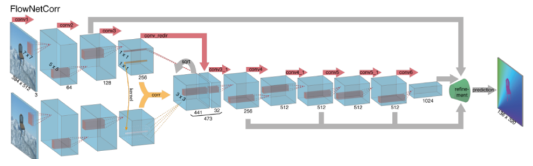
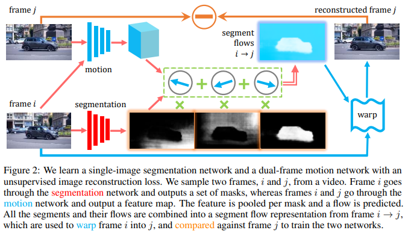
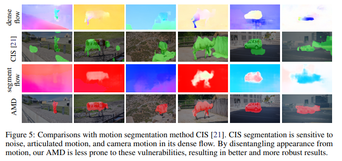
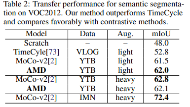

The Emergence of Objectness: Learning Zero-Shot Segmentation from Videos [Eng]

Runtao Liu et al. / The Emergence of Objectness: Learning Zero-Shot Segmentation from Videos / NeurIPS 2021

##  1. Problem definition

In the era of Big Data, millions of data are generated every day. Such an insane number of data opened the door to many AI applications. Supervised learning is known to produce great results but depends on labeled data. Unfortunately, labeling data is really time-consuming and expensive. By using only labeled data in AI field, we are passing by the majority of the data at our disposal.

To tackle this issue, self-supervised learning such as contrastive learning made their apparition. Nonetheless, contrastive learning relies heavily on data augmentation and labeled data for fine-tuning.

In this paper, the authors propose an end-to-end object segmentation model trained on unlabeled videos without any form of augmentation engineering. By using the motion of the objects, the authors plan to perform video segmentation. It's a zero-shot learning method so the model is able to generalize at test time to objects it has never seen. 

## 2. Motivation

### Related work

Contextual information separation : This method segments the object based on the subtraction of the foreground motion with the background motion for simple results. 

Temporal clustering : Many Video Object Segmentation (VOS) models are relying on low-level features to segment moving objects. Typically, NLC and ARP are segmenting object based on spatio-temporal clustering but they are built on top of edge and saliency annotations. Thus, they are not unsupervised. 

Motion Segmentation (FTS, Sage): Recently, motion segmentation made its apparition based on two-frame optical flow. Motion reveals the location and shape of moving objects. Sparse optical flow selects some interesting features like edge to track the motion. The extracted features are passed in the optical flow function from frame to frame and mapped into segmentation masks. Dense optical flow segmentation is more precise because its computing the optical flow of each pixel. Supervised CNN models such as FlowNet, SpyNet, PWC-net are quite successful in estimating the optical flow. However, Sparse Optical flow rely heavily on low-level features definition while Dense Optical flow is computationally demanding. It also requires a large amount of labeled data. 

Motion Grouping (MG) : It is a similar method to the one proposed by the authors. MG cluster pixel together based on similar motion vectors. But, at the difference of the authors model, MG rely on Optical Flow.

### Idea

In optical flows, we traditionally adopt a bottom-up method where we derive optical flow from pixel to attain an image segmentation. In this paper, the authors prefers to proceed from top-to-bottom by predicting the overall moving regions of the scene. Then, they can minimize the errors of the model to obtain a more precise image segmentation. By doing so, they don't use any low-level feature like saliency, edge or optical flow. The goal is for the model to learn the right feature by itself. 

The idea is to decompose the data into two streams of information. The first stream contains the information related to “what is moving” while the second stream stores “how it is moving”. Then, the model will merge those two streams to predict a flow segment. Warping this flow segment in the current frame is used to predict the next frame. Finally, by minimizing the errors between the predicted next frame and the actual next frame, the model learns object segmentation without any low-level processing or optical flow. This segmentation model is richer than the CNN for optical flow since its segmenting on the motion between two frames as well as the appearance itself of one frame. 

## 3. Method

The Appearance-Motion Decomposition model (AMD) conceived by the authors can be explained in 4 steps. 

1. Appearance pathway for feature-based segmentation

The segmentation stream will take an RGB image as input and outputs a feature-based segmentation in 5 channels. The number of segmentation is an hyperparameter of the fully convolutional neural network. After studying the effect of different values, the authors concluded that 5 was the optimal number of channels for this model. The segmentation stream outputs the probability for each pixel to belong to a channel c. The segmentation mask derive from a static image. 

2. Motion pathway for correspondences

At the same time, the motion stream will receive the pair of videos frames and outputs the flow features of the motion. The network architecture used to extract motion follows the architecture of PWC-Net. The network will compute the similarity of each pixel to its neighbors in both frame. Then, the results are transformed into motion correspondence features.

3. Segment flow representation

Then, the model will merge the two flows to get a new view synthesis of the scene. This segment is obtained by pooling the motion correspondence features of the motion pathway V into the image segmentation pathway S for each mask m. 

$$V_m=\frac{\sum_{p=1}^{h*w} V(p)*S_m(p)}{\sum_{p=1}^{h*w}S_m(p)} \in \mathbb{R^{d_v}},  m= 1, . . . , c.$$

Then, they used a multi-layer perceptron as function g to output a common flow vector for all mask to obtain a general idea of the motion in the scene. 

$$F_m=g(V_m) \in \mathbb{R^2},  m= 1, . . . , c.$$

The following formula is used to aggregate all the moving parts into the segment flow F of the entire image of h*w pixel :

$$F(p)=\sum_{m=1}^{c} F_m*S_m(p),  p= 1, . . . , h*w.$$

Using this approach allows the motion and the segmentation to cross-supervise each other. 

4. Reconstruction objective for view synthesis

Now that the model computed a segment flow, it will warp this segment flow into the current frame Xi to predict the next frame Xj. If the model is learning correctly, the predicted frame for Xj should be similar to the actual Xj. The authors are using this notion to train the model. They adopted the SSIM loss to compute the reconstruction error between the two frames and correct both pathways.

## 4. Experiment & Result

### Experimental setup

The Appearance-Motion Decomposition model (AMD) is trained in the following fashion :

- Training dataset : Youtube-VOS (4,000 object-centric videos)
- Training setup :
    - Segmentation network : ResNet50 as well as a fully convolutional head with two blocks
    - Motion network : PWC-Net with random flipping augmentation only
    - Loss : symmetric reconstruction loss
    - Optimizer : Adam with a learning rate of  and weight decay of
    

The performance of the trained model is evaluated on three different tasks :

1. Apply AMD to static images to evaluate zero-shot object segmentation
    - Testing dataset : DUTS, salient object detection benchmark
    - Baseline : Supervised models
    - Evaluation metric : F-measure and MAE
2. Apply AMD to videos to evaluate Zero-shot moving object segmentation
    - Testing dataset : DAVIS 2016, SegTrackv2, FBMS59
    - Baseline : CIS and MG
    - Evaluation metric : Jaccard score
3. Fine-tuning AMD for semantic segmentation
    - Testing dataset : Pascal VOC 2012
    - Baseline : MoCo-v2, TimeCycle

### Result

**Result of experiment 1 : Zero-Shot Saliency Detection**

Salient object detection (SOD) aims at segmenting the image from the perspective of a human visual system (HVS). The pseudo-supervised SOD models used as baselines derive from low-level cues. Even though detecting salient objects in static images is not the purpose of AMD, interestingly, the authors’ model still outperforms the baseline models in both metrics.

**Result of experiment 2 :  Zero-Shot Video Object Segmentation**

The figure below present the results of AMD versus CIS segmentation. While the AMD does not get every pixel of the object, the resulting mask is better than CIS. It is less noisy than CIS, even when the motion cues are weak. For example, the segment flow of the third vaguely notice a motion in the bottom right corner but still manages to segment the animal. But CIS, segment the animal with a part of the ground. 

→ The AMD model trained on Youtube-VOS can segment generic objects as well as pre-existing ones in a fully unsupervised way.

**Result of experiment 3 :  Fine-tuning AMD for semantic segmentation**

In this experiment, the authors want to test their models on semantic segmentation. Semantic Segmentation is a higher level of segmentation since its assigning a label to every pixel in the image. This time, the authors decided to fine-tune and test their model on the Pascal VOC dataset. They are comparing the model with TimeCycle, a self-supervised model, and MoCo-v2, an image-based contrastive model under the same training settings. Here, AMD outperforms TimeCycle significantly by 9,2% but shows really similar results to MoCo-v2.

It's interesting to note the effect of data augmentation on AMD versus MoCo-v2. The constrastive model accuracy increases from 61.5% to 62.8% with heavy data augmentation while the AMD performance remains the same, ranging from 62.0% to 62.1%.

→ The AMD model performs similarly, in regards to semantic segmentation, to the contrastive model MoCo-v2, with or without data augmentation.

## 5. Conclusion

The Appearance-Motion Decomposition model described by the authors is able to segment images as well as videos without using pre-trained modules or data augmentation. While other models are focusing on low-level computation and dense optical flow, they directly proposed to compute a mid-level segment flow. The model used is quite simple but is enough to attain performance quite close to the state-of-the-art contrastive models. However, the training worked using centered objects, simple motions, and fixed frames. The model might not be able to generalize to more complex videos.

### Take home message

> This Appearance-Motion Decomposition model provides a simple but fully unsupervised model for object segmentation in videos as well as pictures. The method generalize correctly on new data. On the downside, it might not work as well on more complex motions or non-centric object.

## Author / Reviewer information


You don't need to provide the reviewer information at the draft submission stage.


### Author

**Korean Name \(English name\)** 

* Emeline Bagoris
* emeline.bagoris@kaist.ac.kr

### Reviewer

## Reference & Additional materials

