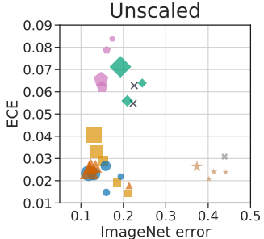
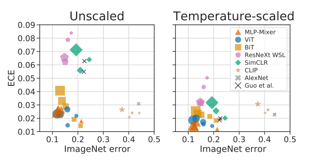
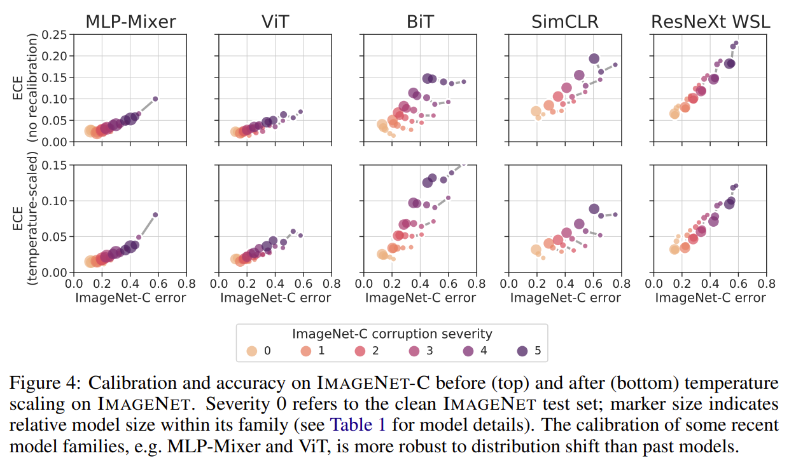
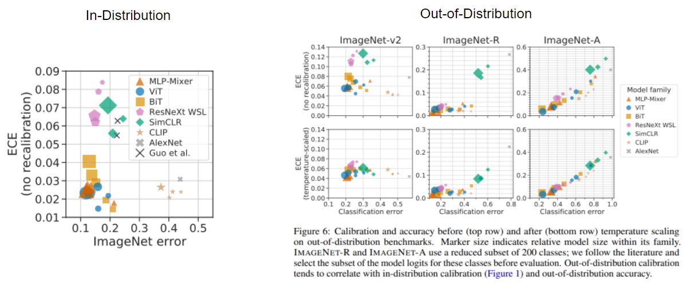

##  1. Problem definition

Because of its significant improvement in accuracy, deep learning is being used in safety-critical applications such as autonomous driving, medical diagnosis, and meteorological forecasting. For such applications, model predictions mustn't be just accurate but **_well-calibrated_**. 

Intensive research focused on improving the model's predictive accuracy, but showed little interest in model calibration. There have been research indicating that modern neural networks are poorly calibrated despite the improvement in accuracy [[1]](#1). Some studies suggest that larger and more accurate models tends to be worse calibrated [[1]](#1).

Since the architecture size, amount of training data, and computing power used by state-of-the-art models continue to rise, these concern of calibration should be examined with much attentions. Additionally, rapid advances in model architecture (e.g. MLP-Mixer, ViT, CLIP, etc.) and training approaches (e.g. Batch Normalization) raise the question whether previous observations on calibration, largely obtained on standard convolutional networks, extend to current state-of-the-art models.   

To address this need, the paper provide a systematic comparison of recent image classification models, relating their accuracy, calibration, and design features.

    

## 2. Motivation

In this section, you need to cover the motivation of the paper including _related work_ and _main idea_ of the paper.

### Related work
* **What is 'Model Calibration'?** 
  * The accuray with which the scores provided by the model reflect its predictive uncertatiny
    
    Consider the input $X \in \chi$ and label $Y \in \upsilon = \{1,...,K\}$. 
    Let $h$ be a neural network with $h(X) = (\hat{Y}, \hat{P})$, where $\hat{Y}$ is a class prediction and $\hat{P}$ is its associated confidence, i.e. probability of correctness (the argmax of the softmax operation). We would like the confidence estimate $\hat{P}$ to be calibrated, which intuitively means that $\hat{P}$ represents a true probability. More formally, we define the _perfect calibration_ as 
    
    $$ \mathbb{P}(\hat{Y}=Y|\hat{P}=p) = p, \forall p \in [0,1]  (1)$$ 

    In all practical settings, achieving perfect calibration is impossible. Also, the probability in (1) cannot be computed using fineiely many samples since $\hat{P}$ is a continuous random variable. This motivates the need for empirical approximations that capture the essense of (1). 

    To estimate the expected accuracy from finite samples, we group predictions into $M$ interval bins (each of size $1/M$) and calculate the accuracy of each bin. Let $B_m$ be the set of indices of samples whose prediction confidence falls into the interval $I_m = (\frac{m-1}{M}, \frac{m}{M}]$.   
    
    The accuracy of $B_m$ is 

    $$acc(B_m) = \frac{1}{|B_m|} \sum_{i \in B_m} I(\hat{y_i} = y_i)$$

    where $\hat{y_i}$ and $y_i$ are the predicted and true class labels for sample $i$.  

    We define the average confidence within bin $B_m$ as 
    $$conf(B_m) = \frac{1}{|B_m|} \sum_{i\in B_m}\hat{p_i},$$  

    where $\hat{p_i}$ is the confidence for sample i.

    $acc(B_m)$ and $conf(B_m)$ approximate the left-hand and right-hand sides of (1) respectively for bin $B_m$. Therefore, a perfectly calibrated model will have $acc(B_m) = conf(B_m)$ for all $m \in \{1,...,M\}.$

* **What is ECE?**

  * To measure miscalibration, the widely used metric is the **_Expected Calibration Error (ECE)_**
    $$ECE = \sum_{m=1}^{M} \frac{|B_m|}{n}|acc(B_m)-conf(B_m)|$$

* **Improving calibration**
  * **Temperature Scaling [[1]](#1)** 

    Temperature scaling is a widely used post-processing step to improve the calibration of a pretrained model without affecting its accuracy. Temperature scaling re-scales a model's logits by a single parameter, chosen to optimize the model's likelihood on a held-out portion of the training data. 

* **Previous Empirical studies of model calibration**
  
  * **Larger models are less calibrated**

    Guo et al. (2017) [[1]](#1) found that modern neural networks are poorly calibrated compared to those from decade ago. They show that larger network tends to be worse calibrated even though the accuracy has been greatly improved. Other work [[2]](#2) have confirmed these findings. These works suggest a trend that larger models are worse calibrated, which would have a significant impact for research towards larger models and bigger datasets.  
  
  * **Distribution shift of input negatively impact calibration**

    Ovadia et al. (2019) [[3]](#3) report that both accuracy and calibration deteriorate with distribution shift.

  * **Correlation between in-distribution and out-of-distribution calibration**

    Ovadia et al. also find the improvements on in-distribution data do not necessarily translate to out-of-distribution calibration in general. They suggest that from these results, there is little correlation between in-distribution and out-of-distribution calibration. 

  
### Idea

The main idea of the paper is to see if previous empirical studies on model calibration extend to current state-of-the-art models. More specifically, they rebut each previous claim from past research as follows:

  1. **Larger models are less calibrated**   
  $\rightarrow$ This paper shows that for more recent models (e.g. ViT), this trend is negligible in-distribution and in fact reverses under distribution shift. 

  2. **Distribution shift of input negatively impact calibration**  
  $\rightarrow$ This paper shows that calibration of recent models decays so slowly under distribution shift that it is negligible in practice. 

  3. **There is little correlation between in-distribution and out-of-distribution calibration** 
  $\rightarrow$ This paper shows that the models with best in-distribution calbiration are also the best-calibrated on a range of out-of-distribution benchmarks. The important implication of this result is that designing models based on in-distribution permance likely also benefits out-of-distribution performance. 

## 3. Method

The paper consider the multi-class classification problem where they obeserve a variable $X$ and predict a categorical variable $Y \in \{1,2,...,k\}$. The paper uses ECE as the measurement of the model's calibration. 
The paper 

## 4. Experiment & Result

### Experimental setup

This section should contain:

* Model families and training setup

  In this paper, they consider a range of recent and historic state-of-the-art image classification models. 

  1. MLP-Mixer (Tolstikhin et al.,2021) [[4]](#4) is based exclusively on multi-layer perceptrons (MLPs) and is pre-trained on large supervised datasets.
  2. ViT (Dosovitskiy et al., 2020)  [[5]](#5) processes images with a transformer architecture and is also pretrained on larger supervised datasets.
  3. BiT [[6]](#6) is a ResNet-based architecture. It is also pre-trained on large supervised datasets. 
  4. ResNext-WSL [[7]](#7) is based on the ResNeXt architecture and trained with weak supervision from biliions of hashtags on social media images. 
  5. SimCLR [[8]](#8) is a ResNet, pretrained with an unsupervised contrastive loss. 
  6. CLIP [[9]](#9) is pretrained on raw text and imagery using a contrastive loss. 
  7. AlexNet was the first convolutional neural network to win the ImageNet challenge. 

  All models are eighter trained or fine-tuned on the IMAGENET training set, except for CLIP, which makes zero-shot predictions using IMAGENET class names as queries. 

* Datasets

  The paper evaluate accuracy and calibration on the IMAGENET validation set and the following out-of-distribution benchmarks using the Robustness Metrics library. 

  1. IMAGENETV2 is a new IMAGENET test set collected by closely following the original IMAGENET labeling protocol.
  2. IMAGENET-C consists of the images from IMAGENET, modified with synthetic perturbations
  3. IMAGENET-R contains artificial renditions of IMAGENET classes such as art, cartoons, drawings, sculptures, and others. 
  4. IMAGENET-A contains images that are classified as belonging to IMAGENET classes by humans, but adversarially selected to be hard to classify for a ResNET50 trained on IMAGENET. 

* Calibration Metric

  The paper uses ECE as the calibration metric. They use 100 bins throughout the paper. 

### Result

  **1. This paper shows that for more recent models (e.g. ViT), the trend of larger model having larger calibration error is negligible in-distribution**
  * In-Distribution Calibration

    * Several modern neural network families (MLP-Mixer, ViT, and BiT) combine high accuracy and state-of-the-art calibration on in-distribuion data. 

       
      _
 The size of marker indicates the relative model size within  its family. 
_ 
    * Temperature scaling reveals consistent properties of model families. 
      * Poor calibration of models can often be remedied by post-processing recalibration (temperature scaling). However, the most recent architecutre are better calibrated than past models even after temperature scaling. 

        
      _
 The size of marker indicates the relative model size within  its family. 
_ 
    * Given that the best-calibrated families (MLP-Mixer and ViT) are non-convolutional, the paper speculate that model architecture, and in particular its spatial inductive bias, play an important role. 

  **2. This paper show that calibration of recent models decays so slowly under distribution shift that it is negligible in practice.**

  * Out-of-Distribution Calibration   
    Regarding the effect of model size on calibration, the paper observe some trend toward worse calibration of larger models on in-distribution data. However, the trend is reversed for most model families as we move out of distribution, especially after accounting for confidence bias by temperature scaling. That is, calibration of larger models is more robust to distribution shift.  

      

  **3. This paper show that the models with the best in-distribution calibration are also the best calibrated on a range of out-of-distribution benchmarks.**
  
  * The performance on several natural OOD datasets is largely consistent with that on ImageNET (in-distribution)

   

## 5. Conclusion

### Pitfalls and Limitations 
Measuring calibration is challenging and while the quantity that is estimated is well specified, the estimator itself could be biased. There are two sources of bias: (1) from estimating ECE by binning (2) from the finite sample size used to stimate the per-bin statistics. 

### Take home message 
* Modern image models are **well calibrated across distribution shift** despite being designed with a focus on accuracy. 
* Model size do not fully account for the calibration differences between model families. 
  * **Architecture** is a major determinant of calibration
  * **MLP-Mixer and ViT (non-convolutional) are among the best-calibrated models both in-distribution and out-of-distribution

  * Further work on **the influence of architecture inductive biases** on calibration and OOD orbustness will be necessary to tell whether these results generalize.  
Please provide one-line \(or 2~3 lines\) message, which we can learn from this paper.

## Author / Reviewer information


You don't need to provide the reviewer information at the draft submission stage.


### Author

**윤희석 \ Hee Suk Yoon 

* Affiliation KAIST EE
* Contact information hskyoon@kaist.ac.kr
* **...**

### Reviewer

1. Korean name \(English name\): Affiliation / Contact information
2. Korean name \(English name\): Affiliation / Contact information
3. ...

## Reference & Additional materials

1. Citation of this paper
2. Official \(unofficial\) GitHub repository
3. Citation of related work  
<a id="1">[1]</a> 
Guo, Chuan, et al. "On calibration of modern neural networks." International Conference on Machine Learning. PMLR, 2017.  
<a id="2">[2]</a> 
Thulasidasan, Sunil, et al. "On mixup training: Improved calibration and predictive uncertainty for deep neural networks." Advances in Neural Information Processing Systems 32 (2019).  
<a id="3">[3]</a> 
Guo, Chuan, et al. "On calibration of modern neural networks." International Conference on Machine Learning. PMLR, 2017.
<a id="4">[4]</a>
Tolstikhin, Ilya O., et al. "Mlp-mixer: An all-mlp architecture for vision." Advances in Neural Information Processing Systems 34 (2021).  
<a id="5">[5]</a>
Dosovitskiy, A., Beyer, L., Kolesnikov, A., Weissenborn, D., Zhai, X., Unterthiner, T., Dehghani,
M., Minderer, M., Heigold, G., Gelly, S., Uszkoreit, J., and Houlsby, N. An image is worth 16x16
words: Transformers for image recognition at scale. In International Conference on Learning
Representations, 2021lp architecture for vision." Advances in Neural Information Processing Systems 34 (2021).  
<a id="6">[6]</a>
Kolesnikov, A., Beyer, L., Zhai, X., Puigcerver, J., Yung, J., Gelly, S., and Houlsby, N. Big transfer
(bit): General visual representation learning. In European Conference on Computer Vision, 2020.  
<a id="7">[7]</a>
Mahajan, D., Girshick, R. B., Ramanathan, V., He, K., Paluri, M., Li, Y., Bharambe, A., and van der
Maaten, L. Exploring the limits of weakly supervised pretraining. In European Conference on
Computer Vision, 2018  
<a id="8">[8]</a> 
Chen, T., Kornblith, S., Norouzi, M., and Hinton, G. E. A simple framework for contrastive learning
of visual representations. In International Conference on Machine Learning, 2020.  
<a id="9">[9]</a> 
Radford, A., Kim, J. W., Hallacy, C., Ramesh, A., Goh, G., Agarwal, S., Sastry, G., Askell, A.,
Mishkin, P., Clark, J., et al. Learning transferable visual models from natural language supervision.
Technical report, OpenAI, 2021
5. ...

