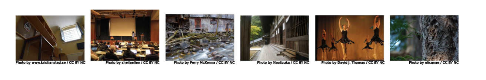
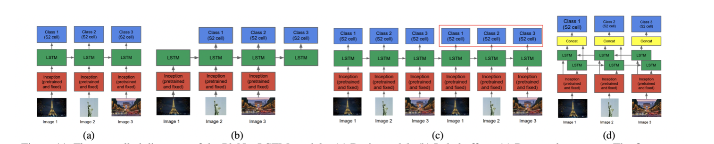
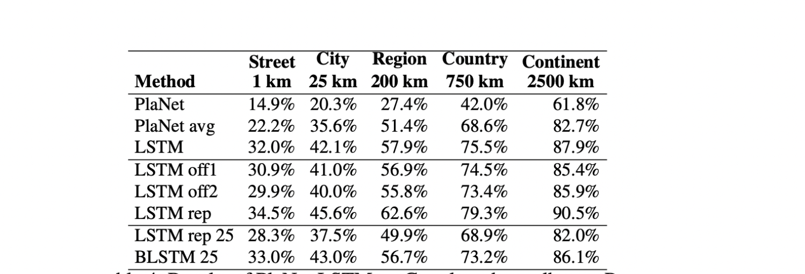
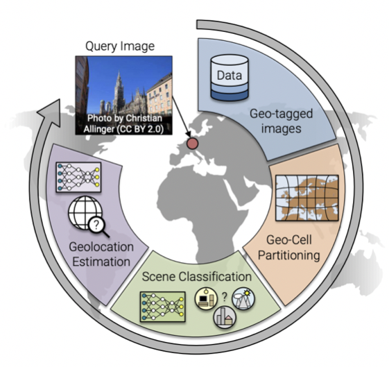
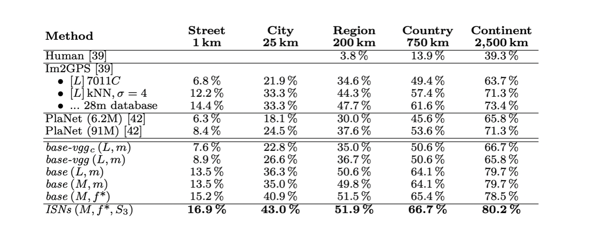
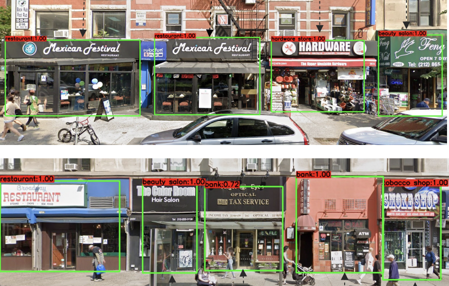

---
Weyand et al. / PlaNet - Photo Geolocation with Convolutional Neural Networks / ECCV 2016
---

# \(Template\) PlaNet and image geolocation \[English\]

##  1. Problem definition

You probably have heard of the widely known game « Geoguesser ». If not the idea is simple, the player have to find the exact location of a scene (taken from street view), just by looking at visual cues in the image. Player can get pretty good at the exercise, looking for architecture style, plant species or written clue, and some are able to pin point the exact location, close to the meter, of some specific image.

For anyone interested a little bit in computer science, and most specifically  computer vision, a question come directly in mind : « How good a computer can be at « Gueoguesser » ? We will talk about different technique that has been used to solve this task, we will then  explain and discuss the PlaNet model, which serve as the « benchmark «  in the field and has been one of the first paper using deep neural network to solve the problem and then we will see different technic that have been used to improved the accuracy.

## 2. Motivation

### Related work

#### IM2GPS/Data driven technic

Before the use of convolutional neural network (CNN) for image processing and analysis, researcher used more data driven technic. One of the famous model used to solve this task in this way is « IM2GPS ».

IM2GPS extract features from the image and the used a KNN model to match the prediction with some of the 6 millions images store in the model. Some of the features extract are : Tiny Images (color image space) , Color histograms, Texton Histograms (texture features) , Line Features, Gist Descriptor + Color and  Geometric Context.

Then they used a 1-NN approached and matched the GPS coordinates of the first nearest neighbor. 

IM2GPS is able to give the localization of 16% of the test image in a range of 200km, which is 18 times better than random guesses. At the times that  was some pretty good result and show that computer could give be somehow accurate for this kind of task.

The technic used is highly dependent on the number of data available, and could get some way better result with way more data, even close perfect if composed of photo from every street and angle on the planet. At the moment, most of developed technics used large amount of data to train deep learning network, but by focusing on image gathering and big data optimisation, there are good chances that some variant of this approach could nowadays be way more competitive.

### Idea

#### Planet/ Deep learning and Convolutional network

#### Classification problem

One of the main  advantage of classification over classical regression on longitude/lattitude is the possibility to output a probability distribution over the whole world.

By using Google’s open source S2 geometry library, the author can produce a non overlapping partioning of the planet. By projecting the sphere into a cube and then subdivided the the six side hierarchically by quad-trees where each nodes in the tree correspond to a cell.
But each part of the world aren’t represented in the same manner in the photo dateset, and to prevent having important imbalance class, they perform what they called « Adaptive Partitioning »
,based on distribution of localisation in the dataset : starting at the roots, the recursively descend the tree till each cells contained no more than a threshold number of photos and discard the regions where the number of photos is below an other threshold. In the end, the size of each cell is correlated to the likelihood of a photo being taken in this area.

## 3. Method

The architecture used is based one the Inception architecture. Developed by Google in 2014 is based on a succession of inception module.

The inception architecture has been designed by Google researcher to permit the training of deeper model. The 2 mains characteristics of this model, are the used of multiple convolution operation with different kernel size operating in a parallel manner at each layer, and the used of 1x1 convolution.
The used of different kernel size give to the model the opportunity to choose at each layer the importance of each kernel size. The model can learn its own architected dynamically. The 1x1 convolution are used to reduced the number of channel before each larger convolution. Nowadays, this kind of architecture are still widely used and continue to be improved.

The inception model is just a superposition of different inception module.

## 4. Experiment & Result

The model used consist of 74.7M parameters, which found to be the optimal number. Upscale this number wasn’t giving any improvement and reducing was affecting the accuracy.
They trained the model for 2.5 months on FLickR Dataset until the convergence of the validation set accuracy.

### Dataset

Composed of 125 millions of picture with gps coordinate label taken from all over the web with close to no prior selection. The dataset is composed of portait, landscape, interior photography but his also extremely noisy with image of product, pet, cars etc.

### Result

The accuracy for the model has then been test on a set of 2 millions pictures taken from the social media FlickR.
PlaNet is able to localize 3.6% of the images at street-level accuracy and 10.1% at city-level accuracy. 28.4% of the photos are correctly localized at country level and 48.0% at continent level.

PlaNet vs IM2GPS:
PlaNet localizes 236% more images accurately at street level. The gap narrows at coarser scales, but even at country level PlaNet still localizes 51% more images accurately. An other advantage of using a deep learning approach compared to a data driven one, is the size of storage need to operate. IMG2PS needs to 8.4TB of memory (having to store vector representation of each photos in the training data set), compared to 350MB for Planet, making in it more easily usable on different platform.

PlaNet vs Human:
Compte against 10 well-traveled human subjects in a game of Geoguessr (www.geoguessr.com).
humans and PlaNet played a total of 50 different rounds. In total, PlaNet won 28 of the 50 rounds with a median localization error of 1131.7 km, while the median human localization error was 2320.75 km.

## 5. Improvement technics

### Use of LSTM network to classify a set of pictures.

Given an image, we extract an embedding vector from the final layer before the SoftMax layer in PlaNet. This vector is fed into the LSTM unit. The output vector of the LSTM is then fed into a SoftMax layer that performs the classification into S2 cells. We feed the images of an album into the model in chronological order. For the Inception part, we re-use the parameters of the single image model. During training, we keep the Inception part fixed and only train the LSTM units and the SoftMax layer.

Using a group of photos and LSTM layer help to classify some images that have normally an important uncertainty. This method out performed a simple average on the single prediction of all the photos in the album.

### Scene recognition as a pre processing technic 

In the paper « Geolocation Estimation of Photos using a Hierarchical Model and Scene Classification » the author decided to use scene recognition in pair with the classification step. The idea is to limit the complexity of the task by dividing it into 2 main part. Indeed, how big the model is, it can be quite hard for a it to memorize the visual appearance of the entire earth and to simultaneously learn a model for scene understanding. Indeed, depending on the environnement, indoor, outdoor, city etc. require the model to focus on different feature of the image. According to the author, photo classification in urban environment tend to focus more on architecture, people or street signes. However, in more natural environnement, plant and road seems to have bigger impact on the model decision. 

One of the idea propose by the author is to first used a model to classify in which environnement the photo has been taken and then used different model trained to geolocalize particular environnement (ISN)

The second idea was to consider this task as multi classification task. By training simultaneously 2 classifier (one for scene recognition and the other for the geolocalization task). Doing that, the model can learn to adapt between environnement and has been shown to help increase the accuracy of the primary task (MTN).

Both this technic shows significant improvement on the accuracy.

### Exploration option

#### Cross-view image localisation:

Cross-view image localisation is mostly referring in the field as being able to match a street view level images with a satellite images within a predefined set.

This task has been research for a long time and different techniques has emmerged. 

No paper or researcher have been published about using this kind of principle to improve the current image localization model. But by directly try to extract features or using it as preprocessing or post processing technic, it could be a good direction for improvement to research.

#### Divided the task even more:

In most images, there are different clue that can give important information on the localization of the image. For example some store or building names, some street signe or even the immatriculation of a vehicle. By training various model to try to detect more precise clue, and by using some web search API, we could get for a huge sample of images some close to perfect localization match.

Detecting and analysing numberplate is a task taht has been widly done in computer vision, and now it's possible to find very accurate detection model. By then extracting the some of the text in the number plate or by matching it with a dataset of all kind of numberplate, it would be possible to narrow the localization possibilities.

There exist also some dataset and model that have been designed to detect and analyse front store,this paper for example Detecting, Classifying, and Mapping Retail Storefronts UsingStreet-level Imagery used YOLOV3 architecture, by using classic CNN model.
By detection the name of potential store or building in the image and automaticly scarp internet for infomration could also be a great solution for a number of images.

If using internet is not an option, this kind of information could be used as a feature exctraction technics and then provide to some classification layer.

## 5. Conclusion

Blablablabla
Blablablabla
Blablablabla
Blablablabla
Blablablabla

### Take home message \(오늘의 교훈\)

Please provide one-line \(or 2~3 lines\) message, which we can learn from this paper.

> All men are mortal.
>
> Socrates is a man.
>
> Therefore, Socrates is mortal.

## Author / Reviewer information


You don't need to provide the reviewer information at the draft submission stage.


### Author

**Korean Name \(English name\)** 

* Affiliation \(KAIST AI / NAVER\)
* \(optional\) 1~2 line self-introduction
* Contact information \(Personal webpage, GitHub, LinkedIn, ...\)
* **...**

### Reviewer

1. Korean name \(English name\): Affiliation / Contact information
2. Korean name \(English name\): Affiliation / Contact information
3. ...

## Reference & Additional materials

1. Citation of this paper
2. Official \(unofficial\) GitHub repository
3. Citation of related work
4. Other useful materials
5. ...

