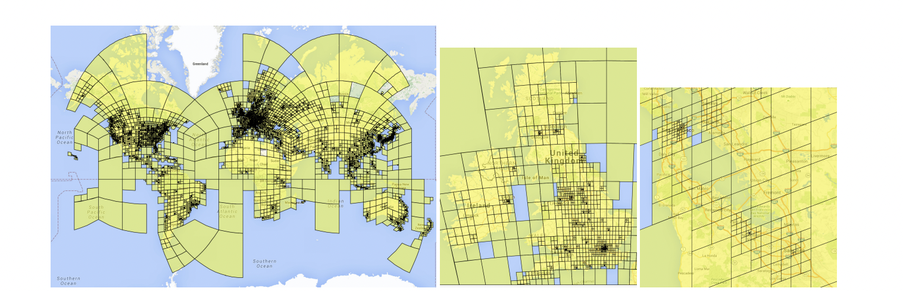

---
Weyand et al. / PlaNet - Photo Geolocation with Convolutional Neural Networks / ECCV 2016
---

# \(Template\) PlaNet and image geolocation \[English\]

##  1. Problem definition

You probably have heard of the widely known game « Geoguesser ». If not the idea is simple, the player have to find the exact location of a scene (taken from street view), just by looking at visual cues in the image. Player can get pretty good at the exercise, looking for architecture style, plant species or written clue, and some are able to pin point the exact location, close to the meter, of some specific image.

For anyone interested a little bit in computer science, and most specifically  computer vision, a question come directly in mind : « How good a computer can be at « Gueoguesser » ? We will talk about different technique that has been used to solve this task, we will then  explain and discuss the PlaNet model, which serve as the « benchmark «  in the field and has been one of the first paper using deep neural network to solve the problem and then we will see different technic that have been used to improved the accuracy.

## 2. Motivation

### Related work

#### IM2GPS/Data driven technic

Before the use of convolutional neural network (CNN) for image processing and analysis, researcher used more data driven technic. One of the famous model used to solve this task in this way is « IM2GPS ».

IM2GPS extract features from the image and the used a KNN model to match the prediction with some of the 6 millions images store in the model. Some of the features extract are : Tiny Images (color image space) , Color histograms, Texton Histograms (texture features) , Line Features, Gist Descriptor + Color and  Geometric Context.

Then they used a 1-NN approached and matched the GPS coordinates of the first nearest neighbor. 

IM2GPS is able to give the localization of 16% of the test image in a range of 200km, which is 18 times better than random guesses. At the times that  was some pretty good result and show that computer could give be somehow accurate for this kind of task.

The technic used is highly dependent on the number of data available, and could get some way better result with way more data, even close perfect if composed of photo from every street and angle on the planet. At the moment, most of developed technics used large amount of data to train deep learning network, but by focusing on image gathering and big data optimisation, there are good chances that some variant of this approach could nowadays be way more competitive.

### Idea

#### Planet/ Deep learning and Convolutional network

#### Classification problem

One of the main  advantage of classification over classical regression on longitude/lattitude is the possibility to output a probability distribution over the whole world.

By using Google’s open source S2 geometry library, the author can produce a non overlapping partioning of the planet. By projecting the sphere into a cube and then subdivided the the six side hierarchically by quad-trees where each nodes in the tree correspond to a cell.
But each part of the world aren’t represented in the same manner in the photo dateset, and to prevent having important imbalance class, they perform what they called « Adaptive Partitioning »
,based on distribution of localisation in the dataset : starting at the roots, the recursively descend the tree till each cells contained no more than a threshold number of photos and discard the regions where the number of photos is below an other threshold. In the end, the size of each cell is correlated to the likelihood of a photo being taken in this area.

## 3. Method

The architecture used is based one the Inception architecture. Developed by Google in 2014 is based on a succession of inception module.

## 4. Experiment & Result


If you are writing **Author's note**, please share your know-how \(e.g., implementation details\)


This section should cover experimental setup and results.  
Please focus on how the authors of paper demonstrated the superiority / effectiveness of the proposed method.

Note that you can attach tables and images, but you don't need to deliver all materials included in the original paper.

### Experimental setup

This section should contain:

* Dataset
* Baselines
* Training setup
* Evaluation metric
* ...

### Result

Please summarize and interpret the experimental result in this subsection.

## 5. Conclusion

In conclusion, please sum up this article.  
You can summarize the contribution of the paper, list-up strength and limitation, or freely tell your opinion about the paper.

### Take home message \(오늘의 교훈\)

Please provide one-line \(or 2~3 lines\) message, which we can learn from this paper.

> All men are mortal.
>
> Socrates is a man.
>
> Therefore, Socrates is mortal.

## Author / Reviewer information


You don't need to provide the reviewer information at the draft submission stage.


### Author

**Korean Name \(English name\)** 

* Affiliation \(KAIST AI / NAVER\)
* \(optional\) 1~2 line self-introduction
* Contact information \(Personal webpage, GitHub, LinkedIn, ...\)
* **...**

### Reviewer

1. Korean name \(English name\): Affiliation / Contact information
2. Korean name \(English name\): Affiliation / Contact information
3. ...

## Reference & Additional materials

1. Citation of this paper
2. Official \(unofficial\) GitHub repository
3. Citation of related work
4. Other useful materials
5. ...

