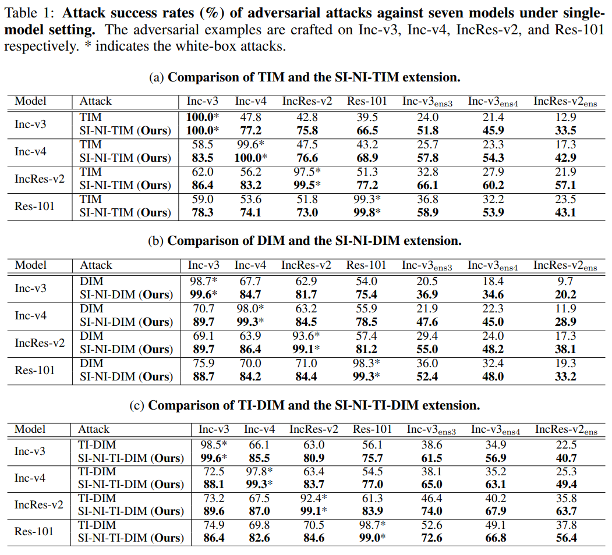
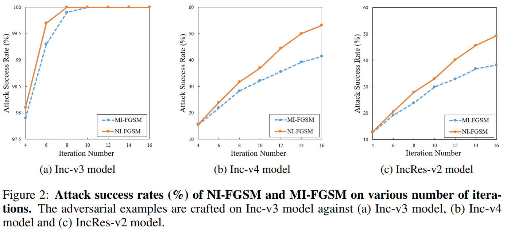

# Nesterov and Scale-Invariant Attack \[Kor\]

##  1. Problem definition

현재 GPU, TPU 등의 하드웨어의 발전으로 인해 컴퓨터의 병렬 연산 처리 능력이 점점 발전하고 있습니다. 이에 힘입어 2012년 ImageNet Challenge 에서 AlexNet이 우승을 거머쥐며 머신러닝 알고리즘이 주목을 받기 시작했습니다. 이로부터 약 10년이 지난 현재 많은 **심층 신경망 (Deep Neural Network, DNN)** 알고리즘이 개발되었고,  컴퓨터 비전, 자율주행 자동차, 추천시스템, 의학, 약학분야 등 여러 분야와 어플리케이션에서 다양한 문제를 해결하는데 사용되고 있습니다. 하지만 최근 이러한 DNN 모델들이 **적대적 공격 (Adversarial Attack, AA)** 에 매우 취약하다는 사실이 발견되었습니다. 그 이후, 머신러닝 모델의 **강건성 (robustness)** 을 판단하기 위한 방법으로 적대적 공격에 대한 연구가 진행되고 있습니다. 적대적 공격이란 머신러닝 모델을 속이기 위해 모델에 입력되는 이미지에 사람 눈에는 잘 보이지 않는 **적대적 변화 (adversarial perturbation)** 를 더해주는 것입니다. 이렇게 만들어진 조작된 이미지를 **적대적 예시 (Adversarial Example)** 라고 합니다.  또한 적대적 예시가 모델을 얼마나 잘 속였는지에 대한 평가 척도로 **fooling rate (FR)** 을 사용합니다. 또한, 우리가 공격하고자 하는 모델의 정보를 알고 있는 경우 이를 **white-box attack** 이라고 하며, 모델의 정보를 모를 때에는 **black-box attack** 이라고 합니다.

$$ x $$를 clean image, $$y^{true}$$를 true label, $$ f(\cdot) $$을 머신러닝 모델이라고 하면, 적대적 공격의 목적은  다음을 만족시키는 adversarial perturbation $$\delta$$를 만드는 것입니다.
$$
f(x + \delta) \ne y^{true}, \qquad \text{s.t.}\ ||\delta||\le\epsilon
$$
본 논문에서는 이러한 adversarial example 즉, $$x^{adv} = x+\delta$$를 더 효율적으로 제작하면서, 만들어진 adversarial example이 더 높은 fooling rate (FR)와 모델 전이성 (model transferability)를 가지도록 하는  AA method를 찾고자 합니다.

## 2. Motivation

### Related work

우리가 머신러닝 모델을 훈련시킬 때는 gradient descent 방식을 통해 이미지 $$x$$와 true label $$y^{true}$$에 대해 해당 loss $$J(x, y^{true})$$를 점차 줄여나가며 모델을 훈련시킵니다. 여기에서 아이디어를 얻어 AA method들은 true label에 대한 loss  $$J(x, y^{true})$$를 키우는 방식으로 adversarial example을 학습시킵니다. 이때 대부분의 AA method들은 머신러닝 모델을 훈련시킬때 처럼 gradient based method를 사용합니다. 다양한 gradient based method들을 비롯하여 다음과 같은 다양한 AA method들이 있습니다.

#### Fast Gradient Sign Method (FGSM)

FGSM은 다음과 같이 one-step update를 통해 adversarial example $x^{adv}$를 만듭니다.
$$
x^{adv} = x + \epsilon \cdot \text{sign}(\nabla _x J(x, y^{true}))
$$
이때, $$\text{sign}(\cdot)$$함수는 perturbation의 $$L_\infin$$ bound를 $$\epsilon$$으로 제한하는 역할을 합니다.

#### Iterative Fast Gradient Sign Method (I-FGSM)

I-FGSM은 FGSM의 iterative한 버전입니다. 다음 수식에 나타나 있듯이 각 iteration마다 step size $\alpha$를 사용합니다.

$$
x_0 = x,\quad x_{t+1}^{adv}=\text{Clip}_x^\epsilon\{x_t^{adv}+\alpha \cdot \text{sign}(\nabla_xJ(x_t^{adv}, y^{true}))\}
$$
여기서 $$\text{Clip}_x^\epsilon(\cdot)$$은 adversarial example이 $$x$$의 $$\epsilon-\text{ball}$$ 내부에 있도록 제한하는 역할을 합니다.

#### Projected Gradient Descent (PGD)

PGD attack은 I-FGSM을 약간 변형한 버전입니다. I-FGSM의 $$x_0$$에 $$x$$대신 랜덤한 perturbation을 더한 이미지를 사용하여 오리지널 I-FGSM보다 더욱 강력한 adversarial example을 만들어 낼 수 있습니다.

#### Momentum Iterative Fast Gradient Sign Method (MI-FGSM)

이 방법은 I-FGSM에 momentum을 통합한 방법으로, 이 방법을 사용하면 adversarial example의 모델 전이성이 높아집니다. 다음과 같은 방법으로 adversarial example을 업데이트 합니다.
$$
g_(t+1) = \mu \cdot g_t + \frac{\nabla_xJ(x_t^{adv}, y^{true})}{||\nabla_xJ(x_t^{adv}, y^{true})||_1},\\
x_{t+1}^{adv} = \text{Clip}^\epsilon_x\{x_t^{adv} + \alpha \cdot \text{sign}(g_{t+1})\}
$$

이때, $$g_t$$는 iteration $$t$$에서의 누적 gradient를 나타내며, $$\mu$$는 $$g_t$$의 decay factor입니다.

#### Diverse Input Method (DIM)

DIM은 모든 iterative gradient based method에 적용할 수 있습니다. DIM방법은 매 iteration마다 input image에 다양한 변형을 가합니다. 이미지를 변형할 때는 랜덤하게 이미지 크기를 조절하는 random resizing, 이미지 바깥에 랜덤으로 픽셀을 추가하는 random padding 방법을 이용합니다. DIM을 사용하면 adversarial example의 모델 전이성을 높일 수 있습니다.

#### Translation-Invariant Method (TIM)

TIM에서는 adversarial example을 만들 때 하나의 이미지만 이용하는 것이 아니라 해당 이미지를 평행이동한 새 이미지 세트를 이용하여 adversarial example을 만듭니다. TIM과 DIM을 결함한 TI-DIM은 매우 강력한 black-box attack 방법입니다.

#### Carlini & Wagner attack (C&W)

C&W attack은 다음 식을 최적화하여 adversarial example을 만들어 냅니다.
$$
\underset{x^{adv}}{\text{arg min}} ||x^{adv}-x||_p-c \cdot J(x^{adv}, y^{true})
$$
위의 식에 드러나 있듯, C&W attack은 true label에 대한 loss를 최대화 하면서 동시에 adversarial example과 clean image사이의 차이를 최소화합니다. C&W attack은 매우 강력한 white-box attack 방법이지만 black-box 세팅에서는 부족한 모델 전이성을 보입니다.

### Idea

위에서 설명한 iterative gradient based AA method들을 보면 neural network를 학습시키는 과정과 매우 닮았다는 것을 알 수 있습니다. 이러한 관점에서 보면 adversarial example을 model의 파라미터와 대응시켜 생각할 수 있습니다. 따라서 adversarial example의 모델 전이성을 높이는 것은 머신러닝 모델의 generalization ability를 높이는 것과 비슷한 관점에서 바라볼 수 있습니다.

머신러닝 모델의 generalization abilty를 높이기 위해 크게 두 가지 방법이 사용됩니다. 첫 번째는 더 나은 최적화 알고리즘을 사용하는 것이며, 두 번째는 원본 이미지에 변형을 가해 데이터 개수를 증강시키는 data augmentation 방법을 사용하는 것 입니다. 본 글에서 소개하는 논문은 여기에서 아이디어를 얻어 모델 전이성을 높이기 위해 두 가지 방법을 소개합니다. 첫 번째는 더 나은 최적화 알고리즘, 즉 Nesterov accelerated gradient를 사용하는 것이며, 두 번째는 여러 모델에서 학습시키는 효과를 얻기 위한 model augmentation 방법으로 scaled image를 사용하는 방법을 제안합니다.

## 3. Method

### Nesterov Iterative Fast Gradient Sign Method

**Nesterov Accelated Gradient (NAG)** 는 모델 학습을 빠르게 수렴시킴으로써 training process를 효과적으로 가속시킬 수 있는 더욱 발전된 momentum method라고 할 수 있습니다. NAG는 다음 식으로 나타낼 수 있습니다.
$$
v_{t+1} = \mu \cdot v_t + \nabla_{\theta_t}J(\theta_t-\alpha \cdot \mu \cdot v_t),\\\theta_{t+1} = \theta_t - \alpha \cdot v_{t+1}
$$
일반적인 momentum method에서는 현재의 parameter값을 이용하여 gradient를 구하지만 NAG에서는 다음 time step에서의 parameter를 예상하여 gradient 값을 구합니다. 위 식에서 loss function $$J(\cdot)$$내부에 들어 있는 값인 $$\theta_t - \alpha \cdot \mu \cdot v_t$$가 바로 현재 gradient인 $$v_t$$를 이용한 parameter의 예상값이 되는 것입니다. 이렇게 함으로써 모델을 더욱 빠르게 수렴시킬 수 있고 poor local minima에 빠지는 것을 방지함으로써 transfereability 또는 generaliztion ability를 높여줍니다. NAG를 사용한 업데이트 방법이 다음 사진에 잘 나타나 있습니다.

이러한 NAG를 I-FGSM에 적용시킨 것이 바로 본 글이 소개하는 논문이 제시하는 **NI-FGSM** 방법입니다. NI-FGSM에서는 adversarial example을 다음과 같이 업데이트 합니다.
$$
x_t^{nes} = x_t^{adv}+\alpha \cdot \mu \cdot g_t\\
g_{t+1} = \mu \cdot g_t + \frac{\nabla_xJ(x_t^{nes}, y^{true})}{||\nabla_xJ(x_t^{nes}, y^{true})||_1}\\
x^{adv}_{t+1} = \text{Clip}_x^\epsilon\{x_t^{adv} + \alpha \cdot \text{sign}(g_{t+1})\}
$$
여기서도 loss function에 현재 gradient $$g_t$$를 이용하여 예측한 다음 time step의 이미지 $$x_t^{nes} = x_t^{adv}+\alpha \cdot \mu \cdot g_t$$ 를 이용함을 알 수 있습니다.

### Scale-Invariant Attack Method

**Scale-Invariant attack Method (SIM)** 는 scaled image를 이용하여 model augmentation을 수행하는 방법입니다. 기존에 여러 모델에 대해 함께 adversarial example을 학습시키는 ensemble 방법이 존재했지만 이는 ensemble한 모델 전체에 대해 학습시켜야 하기 때문에 computation cost가 매우 컸습니다. 하지만 SIM을 사용하면 image scaling만으로 여러 모델을 학습시키는 효과를 낼 수 있습니다. SIM은 다음 최적화 문제를 통해 adversarial example을 구합니다.
$$
\underset{x^{adv}}{\text{arg max}}\frac{1}{m}\sum^m_{i=0} J(S_i(x^{adv}), y^{true}),\\
\text{s.t.}||x^{adv}-x||_\infin\le\epsilon
$$
여기서 $$S_i(x) = x/2^i$$는 input image $$x$$에 대한 scale copy를 나타냅니다. Scale image가 어떻게 여러 모델을 학습시키는 model augmentation 효과를 보이는지에 대한 논리 전개와 증명은 [**_원본 논문_**](https://arxiv.org/pdf/1908.06281.pdf)에 자세히 서술되어 있으니 참고하시길 바랍니다.

### Attack Algorithm

본 글에서 소개하는 논문은 더 나은 최적화 알고리즘을 가진 NI-FGSM과 model augmentation 방법인 SIM을 함께 사용하는 SI-NI-FGSM을 제안하고 있습니다.  
SI-NI-FGSM 알고리즘은 다음 Algoritm 1.에 나타나 있습니다.

위 알고리즘에서 나타나 있듯 매 iteration 마다 scaled version의 $$x^{nes}_t$$ 의 gradient를 구하여 adversarial example을 업데이트합니다.

또한 SI-NI-FGSM은 DIM, TIM, TI-DIM과 함께 쓰일 수 있는데 이를 각각 SI-NI-DIM, SI-NI-TIM, SI-NI-TI-DIM라고 합니다.

## 4. Experiment & Result

### Experimental setup

* **Dataset**

  ILSVRC 2012 validation set에서 랜덤하게 1000개의 이미지 선택

* **Models**

  Normally trained model에 대해서는 Inception-v3 (Inc-v3), Inception-v4(Inc-v4), Inception-Resnet-v2 (IncRes-v2), Resnet-v2-101 (Res-101) 사용

  Adversarially trained model에 대해서는 Inc-v3~ens3~, Inc-v3~ens4~, IncRes-v2~ens~ 사용 

* **Baselines**

  본 논문에서 제안하는 방식을 결합한 DIM, TIM, TI-DIM을 baseline으로 사용

* **Hyper-parameters**

  Maximum perturbation $$\epsilon = 16$$, number of iteration $$T = 16$$, step size $$\alpha = 1.6$$

  For MI-FGSM, decay factor $$\mu = 1.0$$

  For DIM, transformation probability = 0.5

  For TIM, Gaussian kernel of size $$7 \times 7$$

  For SI-NI-FGSM, number of scale copies $$m=5$$

* **Evaluation metric**

  Attack success rate (%) (or fooling rate, FR)

### Result

#### Attacking a Single Model

Table 1. 은 single model에 대한 attack success rate를 나타냅니다. 표에서 볼 수 있듯이 본 논문에서 제안한 SI-NI-TIM, SI-NI-DIM, SI-NI-TI-DIM 알고리즘이 white-box 와 black-box 세팅에서 TIM, DIM, TI-DIM 보다 항상 높은 attack success rate를 보이는 것을 알 수 있습니다. 특히, black-box 세팅에서 attack success rate가 10%~35%로 아주 크게 증가하였는데, 이를 통해 제안한 방법이 **모델 전이성이 높음**을 알 수 있습니다.

#### Attacking an Ensemble of Models

Table 2.는 여러 모델의 ensemble model에 대한 adversarial example의 attack success rate를 나타냅니다. Table 1.에서와 마찬가지로 본 논문에서 제안하는 방법이 모든 경우에서 attack success rate가 baseline 모델보다 높았습니다. 특히 black-box setting에서 baseline model보다 약 10%~30% 높은 attack success rate를 보입니다. 여기서 black-box model들이 adversally trained model (adversarial example에 강건성을 갖도록 훈련된 모델)이라는 것을 고려하면 이러한 모델이 SI-NI-TIM에는 취약하다는 것을 알 수 있습니다.

#### Attacking Other Advanced Defense Models

Table 3.는 adversarial attack을 막는 defense method에 대한 attack success rate를 나타냅니다. 이때 역시 본 논문에서 제안한 방법이 모든 defense method에 대해 가장 좋은 결과를 보여줍니다. 본 논문에서는 이는 **새로운 보안 이슈**를 가져올 수 있으며 더욱 **강건성을 가진 모델**이 필요하다고 제안하고 있습니다.

#### Comparison with classic attacks

Table 4.는 본 논문에서 제안한 방법과 다양한 classic attack에 대한 attack success rate를 나타내고 있습니다. 표에서 잘 드러나 있듯이 본 논문에서 제안한 방법이 white-box attack과 black-box attack에서 상당한 성능 향상을 보이고 있습니다.

#### NI-FGSM vs. MI-FGSM

Figure 2.는 각 iteration별 NI-FGSM과 MI-FGSM의 attack success rate를 나타냅니다. Iteration 10에서 두 방법 모두 100%를 달성한 Inc-v3 모델을 제외하고는 같은 iteration일 때 MI-FGSM이 attack success rate가 더 높았습니다. 다른 말로는 같은 attack success rate를 달성하기 위해 MI-FGSM이 NI-FGSM 모델보다 더 적은 iteration이 필요합니다. 이는 위에서 언급했듯 Nesterov gradient method가 다음 step의 parameter를 예측하기 때문에 adversarial example 생성을 가속화시키기 때문입니다.

## 5. Conclusion

본 논문에서는 Nesterov Accelerated Gradient (NAG)을 I-FGSM과 결합한 NI-FGSM과 이미지의 scale copy를 이용하여 model augmentation을 구현한 Scale-Invariant attack Method (SIM), 이 둘을 결합한 SI-NI-FGSM을 제안하였습니다. 또한 SI-NI-FGSM과 TIM, DIM, TI-DIM을 결합한 SI-NI-TIM, SI-NI-DIM, SI-NI-TI-DIM을 제시하였습니다. 몇 가지의 실험을 통해 본 논문에서 제안한 방법이 기존 baseline보다 모델 전이성이 높고, 더 빠르게 adversarial example의 attack success rate를 높일 수 있었음을 밝혔습니다. 또한 본 논문에서 제안한 방법이 기존의 adversarially trained model이나 defense method들을 충분히 잘 속일 수 있으며, 따라서 본 논문은 더욱 robust한 모델에 대한 필요성을 제시했습니다.

* **Some opinion about this paper**
  본 논문에서 제안하는 방법이 모든 iterative gradient based method에 적용시킬 수 있다는 점은 아주 큰 장점이라고 생각합니다. 하지만 본 논문에서 제시한 방법이 새로운 방법이라기 보다는 이곳 저곳에서 비슷한 아이디어를 가져와서 전부 결합시켜 성능을 끌어올린 느낌이 많이 들었습니다. 특히 SIM 알고리즘은 TIM 알고리즘에서 image translation을 image scale로만 바꾼 것 같았습니다. TIM 알고리즘에서는 실제로는 이미지를 하나만 사용하여 gradient를 계산하고 이를 kernel연산을 통해 이미지를 여러장 사용한 것과 같은 효과를 내어 효과적으로 computation cost를 줄인 반면, 본 논문에서 제시하는 SIM알고리즘에서는 실제로 scale copy 된 이미지를 여러장 사용하여 gradient를 모두 계산해야 해서 computation cost가 커지지 않을까 하는 생각이 들었습니다. 이러한 관점에서 볼때 NAG를 사용하여 iteration 개수 자체는 줄어들지만 과연 실제로 adversarial example을 만들때 걸리는 시간 자체가 줄어들지에 대한 의문이 들었습니다. 이러한 이유 때문에 개인적으로는 조금 아쉬운 논문이 아니었나 생각이 들었습니다.

### Take home message \(오늘의 교훈\)

앞으로의 삶을 계획하며 살자! Nesterov Accelerated Gradient 처럼.

## Author / Reviewer information


You don't need to provide the reviewer information at the draft submission stage.


### Author

**Korean Name \(English name\)** 

* Affiliation \(KAIST AI / NAVER\)
* \(optional\) 1~2 line self-introduction
* Contact information \(Personal webpage, GitHub, LinkedIn, ...\)
* **...**

### Reviewer

1. Korean name \(English name\): Affiliation / Contact information
2. Korean name \(English name\): Affiliation / Contact information
3. ...

## Reference & Additional materials

1. Citation of this paper
2. Official \(unofficial\) GitHub repository
3. Citation of related work
4. Other useful materials
5. ...

